# Diagramas ER - Plataforma Jurídica
## Diagrama de Entidade-Relacionamento Visual

---

## 📋 Índice

1. [Diagrama Geral](#diagrama-geral)
2. [Módulo de Usuários](#módulo-de-usuários)
3. [Módulo de Processos](#módulo-de-processos)
4. [Módulo de Documentos](#módulo-de-documentos)
5. [Módulo de Comunicação](#módulo-de-comunicação)
6. [Módulo de Agenda](#módulo-de-agenda)
7. [Módulo de Assinaturas e LGPD](#módulo-de-assinaturas-e-lgpd)
8. [Módulo de Verificação](#módulo-de-verificação)
9. [Módulo de Pagamentos](#módulo-de-pagamentos)
10. [Diagrama de Fluxo de Dados](#diagrama-de-fluxo-de-dados)

---

## Diagrama Geral

Visão geral de todas as entidades principais e seus relacionamentos.

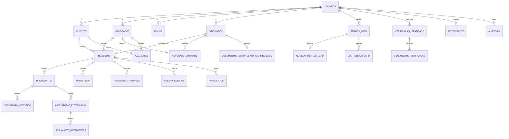
```mermaid
erDiagram
    USUARIOS ||--o{ CLIENTES : "é"
    USUARIOS ||--o{ ADVOGADOS : "é"
    USUARIOS ||--o{ ADMINS : "é"
    USUARIOS ||--o{ SINDICADOS : "é"
    
    CLIENTES ||--o{ PROCESSOS : "possui"
    ADVOGADOS ||--o{ PROCESSOS : "atende"
    SINDICADOS ||--o{ PROCESSOS : "acompanha"
    
    ADVOGADOS ||--o{ ADVOGADO_SINDICADO : "vincula"
    SINDICADOS ||--o{ ADVOGADO_SINDICADO : "vincula"
    
    PROCESSOS ||--o{ DOCUMENTOS : "contém"
    PROCESSOS ||--o{ MENSAGENS : "contém"
    PROCESSOS ||--o{ PROCESSO_ATIVIDADES : "registra"
    PROCESSOS ||--o{ AGENDA_EVENTOS : "possui"
    PROCESSOS ||--o{ PAGAMENTOS : "gera"
    
    DOCUMENTOS ||--o{ DOCUMENTO_HISTORICO : "possui"
    DOCUMENTOS ||--o{ ASSINATURAS_ELETRONICAS : "requer"
    
    ASSINATURAS_ELETRONICAS ||--o{ ASSINANTES_DOCUMENTOS : "possui"
    
    USUARIOS ||--o{ TERMOS_LGPD : "aceita"
    TERMOS_LGPD ||--o{ CONSENTIMENTOS_LGPD : "contém"
    TERMOS_LGPD ||--o{ LOG_TERMOS_LGPD : "registra"
    
    USUARIOS ||--o{ VERIFICACAO_IDENTIDADE : "submete"
    VERIFICACAO_IDENTIDADE ||--o{ DOCUMENTOS_VERIFICACAO : "contém"
    
    SINDICADOS ||--o{ DOCUMENTOS_COMPROBATORIOS_SINDICADO : "possui"
    
    ADVOGADOS ||--o{ AVALIACOES : "recebe"
    CLIENTES ||--o{ AVALIACOES : "realiza"
    
    USUARIOS ||--o{ NOTIFICACOES : "recebe"
    USUARIOS ||--o{ AUDITORIA : "gera"
```

---

## Módulo de Usuários

Estrutura de herança de usuários e relacionamentos.

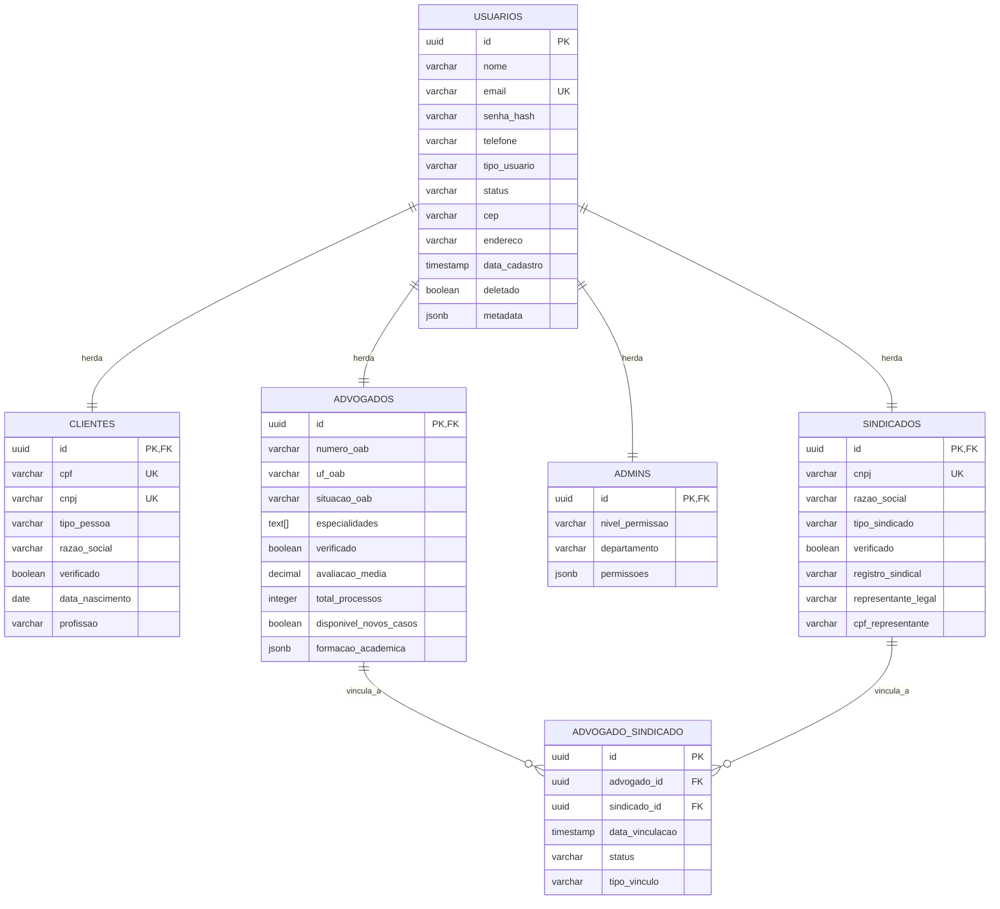
```mermaid
erDiagram
    USUARIOS {
        uuid id PK
        varchar nome
        varchar email UK
        varchar senha_hash
        varchar telefone
        varchar tipo_usuario
        varchar status
        varchar cep
        varchar endereco
        timestamp data_cadastro
        boolean deletado
        jsonb metadata
    }
    
    CLIENTES {
        uuid id PK,FK
        varchar cpf UK
        varchar cnpj UK
        varchar tipo_pessoa
        varchar razao_social
        boolean verificado
        date data_nascimento
        varchar profissao
    }
    
    ADVOGADOS {
        uuid id PK,FK
        varchar numero_oab
        varchar uf_oab
        varchar situacao_oab
        text[] especialidades
        boolean verificado
        decimal avaliacao_media
        integer total_processos
        boolean disponivel_novos_casos
        jsonb formacao_academica
    }
    
    ADMINS {
        uuid id PK,FK
        varchar nivel_permissao
        varchar departamento
        jsonb permissoes
    }
    
    SINDICADOS {
        uuid id PK,FK
        varchar cnpj UK
        varchar razao_social
        varchar tipo_sindicado
        boolean verificado
        varchar registro_sindical
        varchar representante_legal
        varchar cpf_representante
    }
    
    ADVOGADO_SINDICADO {
        uuid id PK
        uuid advogado_id FK
        uuid sindicado_id FK
        timestamp data_vinculacao
        varchar status
        varchar tipo_vinculo
    }
    
    USUARIOS ||--|| CLIENTES : "herda"
    USUARIOS ||--|| ADVOGADOS : "herda"
    USUARIOS ||--|| ADMINS : "herda"
    USUARIOS ||--|| SINDICADOS : "herda"
    ADVOGADOS ||--o{ ADVOGADO_SINDICADO : "vincula_a"
    SINDICADOS ||--o{ ADVOGADO_SINDICADO : "vincula_a"
```

---

## Módulo de Processos

Processos jurídicos e suas atividades.

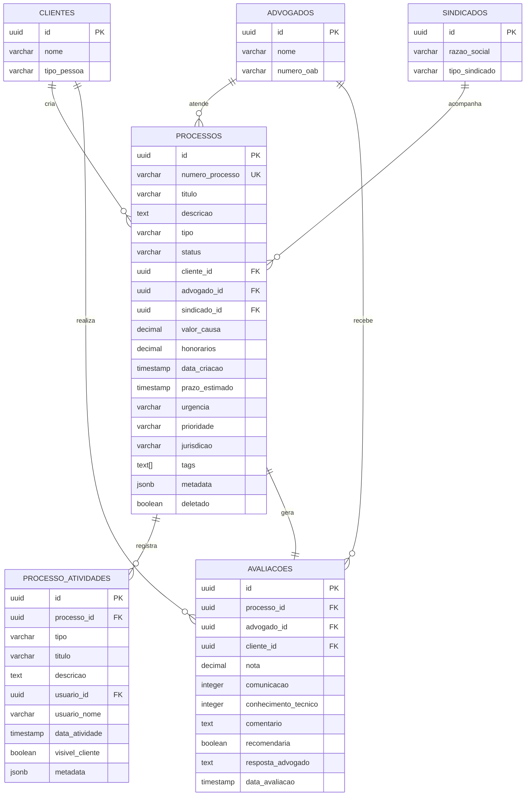
```mermaid
erDiagram
    PROCESSOS {
        uuid id PK
        varchar numero_processo UK
        varchar titulo
        text descricao
        varchar tipo
        varchar status
        uuid cliente_id FK
        uuid advogado_id FK
        uuid sindicado_id FK
        decimal valor_causa
        decimal honorarios
        timestamp data_criacao
        timestamp prazo_estimado
        varchar urgencia
        varchar prioridade
        varchar jurisdicao
        text[] tags
        jsonb metadata
        boolean deletado
    }
    
    PROCESSO_ATIVIDADES {
        uuid id PK
        uuid processo_id FK
        varchar tipo
        varchar titulo
        text descricao
        uuid usuario_id FK
        varchar usuario_nome
        timestamp data_atividade
        boolean visivel_cliente
        jsonb metadata
    }
    
    CLIENTES {
        uuid id PK
        varchar nome
        varchar tipo_pessoa
    }
    
    ADVOGADOS {
        uuid id PK
        varchar nome
        varchar numero_oab
    }
    
    SINDICADOS {
        uuid id PK
        varchar razao_social
        varchar tipo_sindicado
    }
    
    AVALIACOES {
        uuid id PK
        uuid processo_id FK
        uuid advogado_id FK
        uuid cliente_id FK
        decimal nota
        integer comunicacao
        integer conhecimento_tecnico
        text comentario
        boolean recomendaria
        text resposta_advogado
        timestamp data_avaliacao
    }
    
    CLIENTES ||--o{ PROCESSOS : "cria"
    ADVOGADOS ||--o{ PROCESSOS : "atende"
    SINDICADOS ||--o{ PROCESSOS : "acompanha"
    PROCESSOS ||--o{ PROCESSO_ATIVIDADES : "registra"
    PROCESSOS ||--|| AVALIACOES : "gera"
    ADVOGADOS ||--o{ AVALIACOES : "recebe"
    CLIENTES ||--o{ AVALIACOES : "realiza"
```

---

## Módulo de Documentos

Gerenciamento de documentos e versionamento.

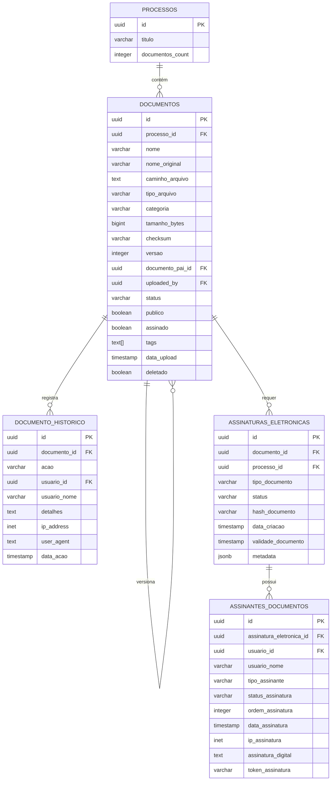
```mermaid
erDiagram
    PROCESSOS {
        uuid id PK
        varchar titulo
        integer documentos_count
    }
    
    DOCUMENTOS {
        uuid id PK
        uuid processo_id FK
        varchar nome
        varchar nome_original
        text caminho_arquivo
        varchar tipo_arquivo
        varchar categoria
        bigint tamanho_bytes
        varchar checksum
        integer versao
        uuid documento_pai_id FK
        uuid uploaded_by FK
        varchar status
        boolean publico
        boolean assinado
        text[] tags
        timestamp data_upload
        boolean deletado
    }
    
    DOCUMENTO_HISTORICO {
        uuid id PK
        uuid documento_id FK
        varchar acao
        uuid usuario_id FK
        varchar usuario_nome
        text detalhes
        inet ip_address
        text user_agent
        timestamp data_acao
    }
    
    ASSINATURAS_ELETRONICAS {
        uuid id PK
        uuid documento_id FK
        uuid processo_id FK
        varchar tipo_documento
        varchar status
        varchar hash_documento
        timestamp data_criacao
        timestamp validade_documento
        jsonb metadata
    }
    
    ASSINANTES_DOCUMENTOS {
        uuid id PK
        uuid assinatura_eletronica_id FK
        uuid usuario_id FK
        varchar usuario_nome
        varchar tipo_assinante
        varchar status_assinatura
        integer ordem_assinatura
        timestamp data_assinatura
        inet ip_assinatura
        text assinatura_digital
        varchar token_assinatura
    }
    
    PROCESSOS ||--o{ DOCUMENTOS : "contém"
    DOCUMENTOS ||--o{ DOCUMENTOS : "versiona"
    DOCUMENTOS ||--o{ DOCUMENTO_HISTORICO : "registra"
    DOCUMENTOS ||--o{ ASSINATURAS_ELETRONICAS : "requer"
    ASSINATURAS_ELETRONICAS ||--o{ ASSINANTES_DOCUMENTOS : "possui"
```

---

## Módulo de Comunicação

Sistema de mensagens e chat.

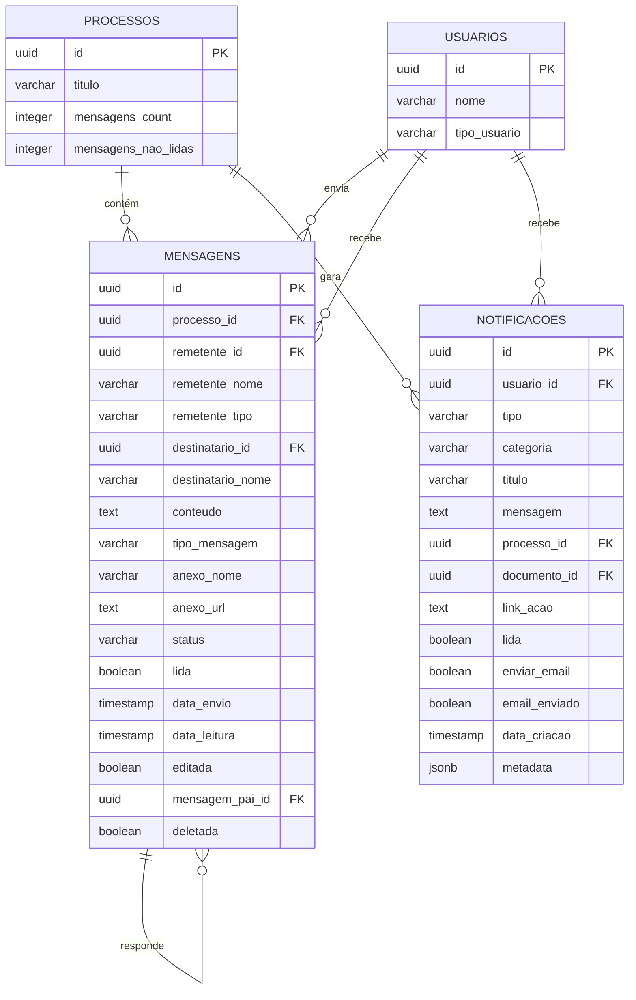
```mermaid
erDiagram
    PROCESSOS {
        uuid id PK
        varchar titulo
        integer mensagens_count
        integer mensagens_nao_lidas
    }
    
    MENSAGENS {
        uuid id PK
        uuid processo_id FK
        uuid remetente_id FK
        varchar remetente_nome
        varchar remetente_tipo
        uuid destinatario_id FK
        varchar destinatario_nome
        text conteudo
        varchar tipo_mensagem
        varchar anexo_nome
        text anexo_url
        varchar status
        boolean lida
        timestamp data_envio
        timestamp data_leitura
        boolean editada
        uuid mensagem_pai_id FK
        boolean deletada
    }
    
    USUARIOS {
        uuid id PK
        varchar nome
        varchar tipo_usuario
    }
    
    NOTIFICACOES {
        uuid id PK
        uuid usuario_id FK
        varchar tipo
        varchar categoria
        varchar titulo
        text mensagem
        uuid processo_id FK
        uuid documento_id FK
        text link_acao
        boolean lida
        boolean enviar_email
        boolean email_enviado
        timestamp data_criacao
        jsonb metadata
    }
    
    PROCESSOS ||--o{ MENSAGENS : "contém"
    USUARIOS ||--o{ MENSAGENS : "envia"
    USUARIOS ||--o{ MENSAGENS : "recebe"
    MENSAGENS ||--o{ MENSAGENS : "responde"
    USUARIOS ||--o{ NOTIFICACOES : "recebe"
    PROCESSOS ||--o{ NOTIFICACOES : "gera"
```

---

## Módulo de Agenda

Eventos e compromissos jurídicos.

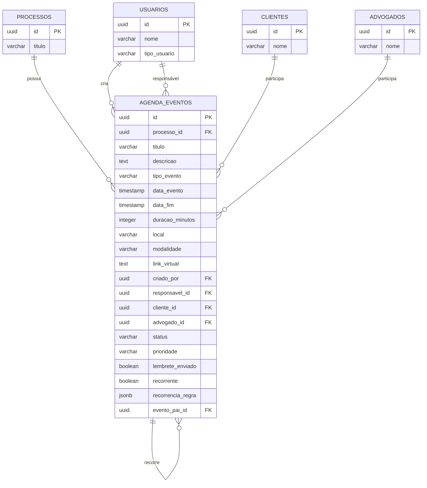
```mermaid
erDiagram
    AGENDA_EVENTOS {
        uuid id PK
        uuid processo_id FK
        varchar titulo
        text descricao
        varchar tipo_evento
        timestamp data_evento
        timestamp data_fim
        integer duracao_minutos
        varchar local
        varchar modalidade
        text link_virtual
        uuid criado_por FK
        uuid responsavel_id FK
        uuid cliente_id FK
        uuid advogado_id FK
        varchar status
        varchar prioridade
        boolean lembrete_enviado
        boolean recorrente
        jsonb recorrencia_regra
        uuid evento_pai_id FK
    }
    
    PROCESSOS {
        uuid id PK
        varchar titulo
    }
    
    USUARIOS {
        uuid id PK
        varchar nome
        varchar tipo_usuario
    }
    
    CLIENTES {
        uuid id PK
        varchar nome
    }
    
    ADVOGADOS {
        uuid id PK
        varchar nome
    }
    
    PROCESSOS ||--o{ AGENDA_EVENTOS : "possui"
    USUARIOS ||--o{ AGENDA_EVENTOS : "cria"
    USUARIOS ||--o{ AGENDA_EVENTOS : "responsável"
    CLIENTES ||--o{ AGENDA_EVENTOS : "participa"
    ADVOGADOS ||--o{ AGENDA_EVENTOS : "participa"
    AGENDA_EVENTOS ||--o{ AGENDA_EVENTOS : "recorre"
```

---

## Módulo de Assinaturas e LGPD

Conformidade e assinaturas eletrônicas.

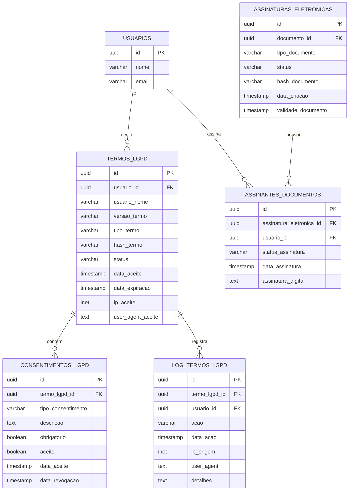
```mermaid
erDiagram
    USUARIOS {
        uuid id PK
        varchar nome
        varchar email
    }
    
    TERMOS_LGPD {
        uuid id PK
        uuid usuario_id FK
        varchar usuario_nome
        varchar versao_termo
        varchar tipo_termo
        varchar hash_termo
        varchar status
        timestamp data_aceite
        timestamp data_expiracao
        inet ip_aceite
        text user_agent_aceite
    }
    
    CONSENTIMENTOS_LGPD {
        uuid id PK
        uuid termo_lgpd_id FK
        varchar tipo_consentimento
        text descricao
        boolean obrigatorio
        boolean aceito
        timestamp data_aceite
        timestamp data_revogacao
    }
    
    LOG_TERMOS_LGPD {
        uuid id PK
        uuid termo_lgpd_id FK
        uuid usuario_id FK
        varchar acao
        timestamp data_acao
        inet ip_origem
        text user_agent
        text detalhes
    }
    
    ASSINATURAS_ELETRONICAS {
        uuid id PK
        uuid documento_id FK
        varchar tipo_documento
        varchar status
        varchar hash_documento
        timestamp data_criacao
        timestamp validade_documento
    }
    
    ASSINANTES_DOCUMENTOS {
        uuid id PK
        uuid assinatura_eletronica_id FK
        uuid usuario_id FK
        varchar status_assinatura
        timestamp data_assinatura
        text assinatura_digital
    }
    
    USUARIOS ||--o{ TERMOS_LGPD : "aceita"
    TERMOS_LGPD ||--o{ CONSENTIMENTOS_LGPD : "contém"
    TERMOS_LGPD ||--o{ LOG_TERMOS_LGPD : "registra"
    ASSINATURAS_ELETRONICAS ||--o{ ASSINANTES_DOCUMENTOS : "possui"
    USUARIOS ||--o{ ASSINANTES_DOCUMENTOS : "assina"
```

---

## Módulo de Verificação

Verificação de identidade e documentos.

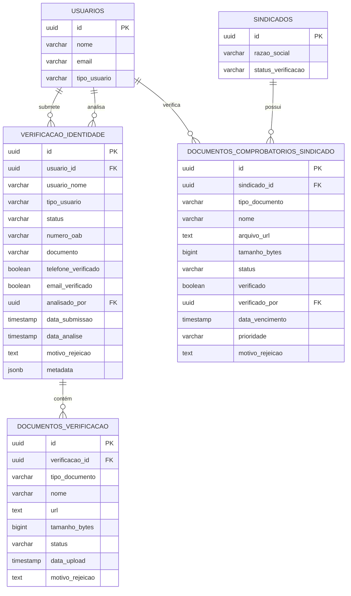
```mermaid
erDiagram
    USUARIOS {
        uuid id PK
        varchar nome
        varchar email
        varchar tipo_usuario
    }
    
    VERIFICACAO_IDENTIDADE {
        uuid id PK
        uuid usuario_id FK
        varchar usuario_nome
        varchar tipo_usuario
        varchar status
        varchar numero_oab
        varchar documento
        boolean telefone_verificado
        boolean email_verificado
        uuid analisado_por FK
        timestamp data_submissao
        timestamp data_analise
        text motivo_rejeicao
        jsonb metadata
    }
    
    DOCUMENTOS_VERIFICACAO {
        uuid id PK
        uuid verificacao_id FK
        varchar tipo_documento
        varchar nome
        text url
        bigint tamanho_bytes
        varchar status
        timestamp data_upload
        text motivo_rejeicao
    }
    
    SINDICADOS {
        uuid id PK
        varchar razao_social
        varchar status_verificacao
    }
    
    DOCUMENTOS_COMPROBATORIOS_SINDICADO {
        uuid id PK
        uuid sindicado_id FK
        varchar tipo_documento
        varchar nome
        text arquivo_url
        bigint tamanho_bytes
        varchar status
        boolean verificado
        uuid verificado_por FK
        timestamp data_vencimento
        varchar prioridade
        text motivo_rejeicao
    }
    
    USUARIOS ||--o{ VERIFICACAO_IDENTIDADE : "submete"
    VERIFICACAO_IDENTIDADE ||--o{ DOCUMENTOS_VERIFICACAO : "contém"
    USUARIOS ||--o{ VERIFICACAO_IDENTIDADE : "analisa"
    SINDICADOS ||--o{ DOCUMENTOS_COMPROBATORIOS_SINDICADO : "possui"
    USUARIOS ||--o{ DOCUMENTOS_COMPROBATORIOS_SINDICADO : "verifica"
```

---

## Módulo de Pagamentos

Gestão financeira e honorários.

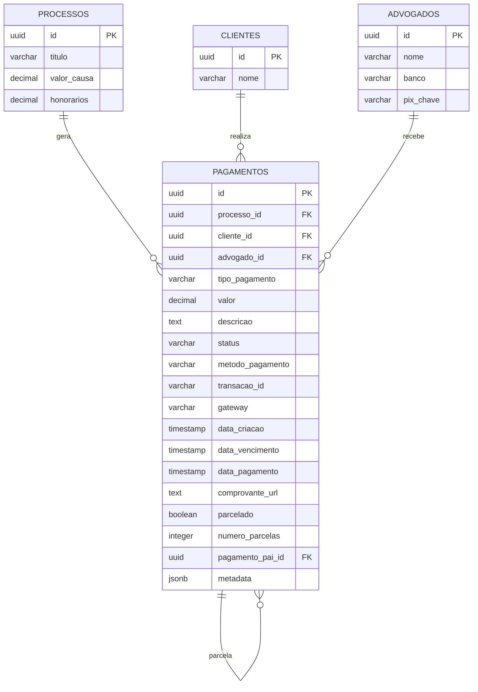
```mermaid
erDiagram
    PROCESSOS {
        uuid id PK
        varchar titulo
        decimal valor_causa
        decimal honorarios
    }
    
    PAGAMENTOS {
        uuid id PK
        uuid processo_id FK
        uuid cliente_id FK
        uuid advogado_id FK
        varchar tipo_pagamento
        decimal valor
        text descricao
        varchar status
        varchar metodo_pagamento
        varchar transacao_id
        varchar gateway
        timestamp data_criacao
        timestamp data_vencimento
        timestamp data_pagamento
        text comprovante_url
        boolean parcelado
        integer numero_parcelas
        uuid pagamento_pai_id FK
        jsonb metadata
    }
    
    CLIENTES {
        uuid id PK
        varchar nome
    }
    
    ADVOGADOS {
        uuid id PK
        varchar nome
        varchar banco
        varchar pix_chave
    }
    
    PROCESSOS ||--o{ PAGAMENTOS : "gera"
    CLIENTES ||--o{ PAGAMENTOS : "realiza"
    ADVOGADOS ||--o{ PAGAMENTOS : "recebe"
    PAGAMENTOS ||--o{ PAGAMENTOS : "parcela"
```

---

## Diagrama de Fluxo de Dados

Fluxo principal de dados na plataforma.

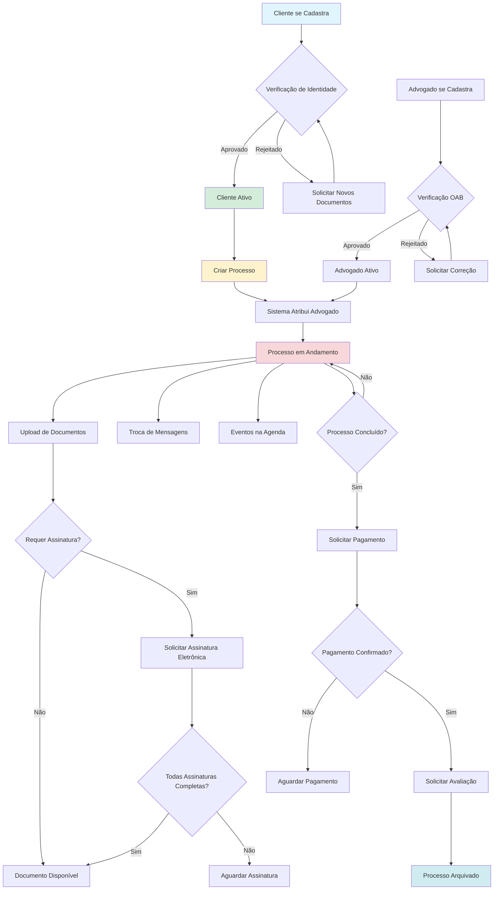
```mermaid
flowchart TD
    A[Cliente se Cadastra] --> B{Verificação de Identidade}
    B -->|Aprovado| C[Cliente Ativo]
    B -->|Rejeitado| D[Solicitar Novos Documentos]
    D --> B
    
    C --> E[Criar Processo]
    E --> F[Sistema Atribui Advogado]
    
    G[Advogado se Cadastra] --> H{Verificação OAB}
    H -->|Aprovado| I[Advogado Ativo]
    H -->|Rejeitado| J[Solicitar Correção]
    J --> H
    
    I --> F
    F --> K[Processo em Andamento]
    
    K --> L[Upload de Documentos]
    K --> M[Troca de Mensagens]
    K --> N[Eventos na Agenda]
    
    L --> O{Requer Assinatura?}
    O -->|Sim| P[Solicitar Assinatura Eletrônica]
    O -->|Não| Q[Documento Disponível]
    
    P --> R{Todas Assinaturas Completas?}
    R -->|Sim| Q
    R -->|Não| S[Aguardar Assinatura]
    
    K --> T{Processo Concluído?}
    T -->|Sim| U[Solicitar Pagamento]
    T -->|Não| K
    
    U --> V{Pagamento Confirmado?}
    V -->|Sim| W[Solicitar Avaliação]
    V -->|Não| X[Aguardar Pagamento]
    
    W --> Y[Processo Arquivado]
    
    style A fill:#e1f5ff
    style C fill:#d4edda
    style E fill:#fff3cd
    style K fill:#f8d7da
    style Y fill:#d1ecf1
```

---

## Diagrama de Estados do Processo

Estados e transições de um processo jurídico.

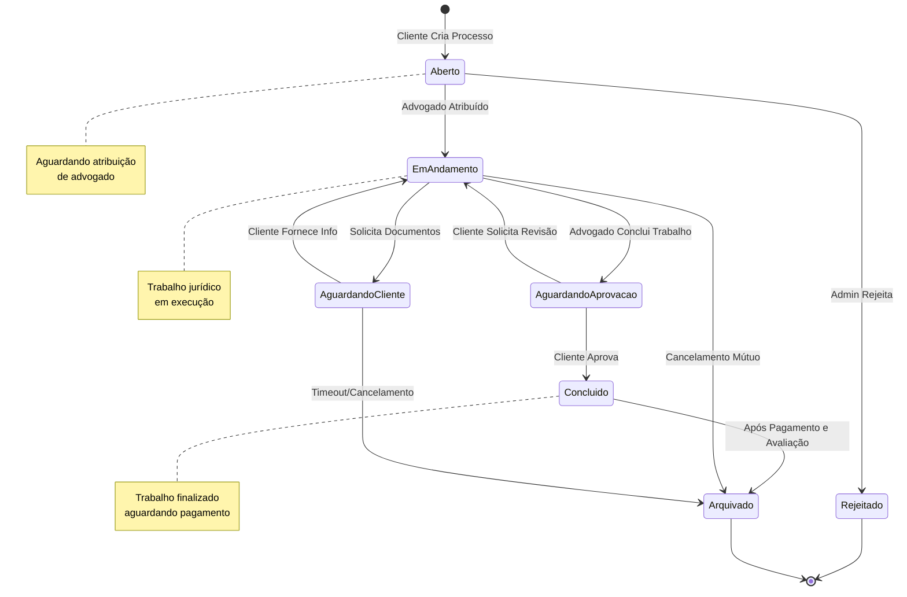
```mermaid
stateDiagram-v2
    [*] --> Aberto: Cliente Cria Processo
    
    Aberto --> EmAndamento: Advogado Atribuído
    Aberto --> Rejeitado: Admin Rejeita
    
    EmAndamento --> AguardandoCliente: Solicita Documentos
    AguardandoCliente --> EmAndamento: Cliente Fornece Info
    
    EmAndamento --> AguardandoAprovacao: Advogado Conclui Trabalho
    AguardandoAprovacao --> EmAndamento: Cliente Solicita Revisão
    AguardandoAprovacao --> Concluido: Cliente Aprova
    
    Concluido --> Arquivado: Após Pagamento e Avaliação
    
    EmAndamento --> Arquivado: Cancelamento Mútuo
    AguardandoCliente --> Arquivado: Timeout/Cancelamento
    
    Rejeitado --> [*]
    Arquivado --> [*]
    
    note right of Aberto
        Aguardando atribuição
        de advogado
    end note
    
    note right of EmAndamento
        Trabalho jurídico
        em execução
    end note
    
    note right of Concluido
        Trabalho finalizado
        aguardando pagamento
    end note
```

---

## Diagrama de Sequência: Criação de Processo

Fluxo detalhado de criação e atribuição de processo.

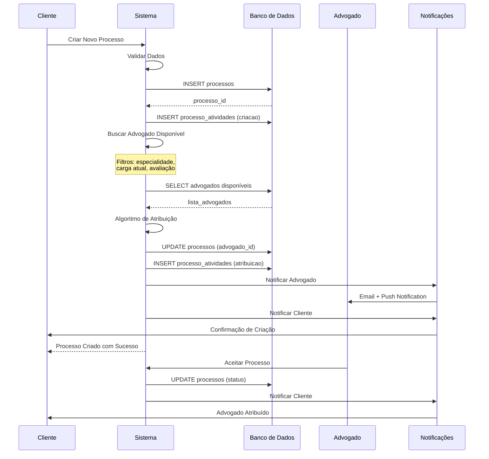
```mermaid
sequenceDiagram
    participant C as Cliente
    participant S as Sistema
    participant DB as Banco de Dados
    participant A as Advogado
    participant N as Notificações
    
    C->>S: Criar Novo Processo
    S->>S: Validar Dados
    S->>DB: INSERT processos
    DB-->>S: processo_id
    
    S->>DB: INSERT processo_atividades (criacao)
    
    S->>S: Buscar Advogado Disponível
    Note over S: Filtros: especialidade,<br/>carga atual, avaliação
    
    S->>DB: SELECT advogados disponíveis
    DB-->>S: lista_advogados
    
    S->>S: Algoritmo de Atribuição
    S->>DB: UPDATE processos (advogado_id)
    
    S->>DB: INSERT processo_atividades (atribuicao)
    
    S->>N: Notificar Advogado
    N->>A: Email + Push Notification
    
    S->>N: Notificar Cliente
    N->>C: Confirmação de Criação
    
    S-->>C: Processo Criado com Sucesso
    
    A->>S: Aceitar Processo
    S->>DB: UPDATE processos (status)
    S->>N: Notificar Cliente
    N->>C: Advogado Atribuído
```

---

## Diagrama de Sequência: Upload e Assinatura de Documento

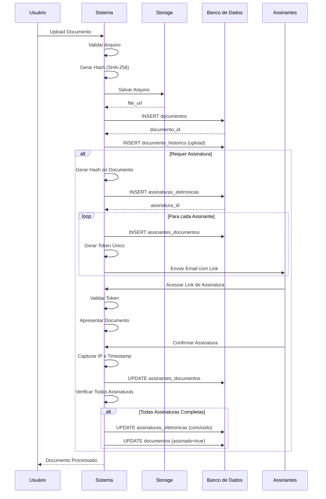
```mermaid
sequenceDiagram
    participant U as Usuário
    participant S as Sistema
    participant ST as Storage
    participant DB as Banco de Dados
    participant AS as Assinantes
    
    U->>S: Upload Documento
    S->>S: Validar Arquivo
    S->>S: Gerar Hash (SHA-256)
    S->>ST: Salvar Arquivo
    ST-->>S: file_url
    
    S->>DB: INSERT documentos
    DB-->>S: documento_id
    
    S->>DB: INSERT documento_historico (upload)
    
    alt Requer Assinatura
        S->>S: Gerar Hash do Documento
        S->>DB: INSERT assinaturas_eletronicas
        DB-->>S: assinatura_id
        
        loop Para cada Assinante
            S->>DB: INSERT assinantes_documentos
            S->>S: Gerar Token Único
            S->>AS: Enviar Email com Link
        end
        
        AS->>S: Acessar Link de Assinatura
        S->>S: Validar Token
        S->>S: Apresentar Documento
        
        AS->>S: Confirmar Assinatura
        S->>S: Capturar IP e Timestamp
        S->>DB: UPDATE assinantes_documentos
        
        S->>S: Verificar Todas Assinaturas
        
        alt Todas Assinaturas Completas
            S->>DB: UPDATE assinaturas_eletronicas (concluido)
            S->>DB: UPDATE documentos (assinado=true)
        end
    end
    
    S-->>U: Documento Processado
```

---

## Diagrama de Classes: Hierarquia de Usuários

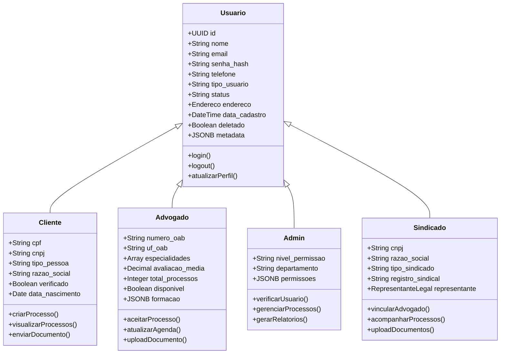
```mermaid
classDiagram
    class Usuario {
        +UUID id
        +String nome
        +String email
        +String senha_hash
        +String telefone
        +String tipo_usuario
        +String status
        +Endereco endereco
        +DateTime data_cadastro
        +Boolean deletado
        +JSONB metadata
        +login()
        +logout()
        +atualizarPerfil()
    }
    
    class Cliente {
        +String cpf
        +String cnpj
        +String tipo_pessoa
        +String razao_social
        +Boolean verificado
        +Date data_nascimento
        +criarProcesso()
        +visualizarProcessos()
        +enviarDocumento()
    }
    
    class Advogado {
        +String numero_oab
        +String uf_oab
        +Array especialidades
        +Decimal avaliacao_media
        +Integer total_processos
        +Boolean disponivel
        +JSONB formacao
        +aceitarProcesso()
        +atualizarAgenda()
        +uploadDocumento()
    }
    
    class Admin {
        +String nivel_permissao
        +String departamento
        +JSONB permissoes
        +verificarUsuario()
        +gerenciarProcessos()
        +gerarRelatorios()
    }
    
    class Sindicado {
        +String cnpj
        +String razao_social
        +String tipo_sindicado
        +String registro_sindical
        +RepresentanteLegal representante
        +vincularAdvogado()
        +acompanharProcessos()
        +uploadDocumentos()
    }
    
    Usuario <|-- Cliente
    Usuario <|-- Advogado
    Usuario <|-- Admin
    Usuario <|-- Sindicado
```

---

## Diagrama de Componentes: Arquitetura do Sistema

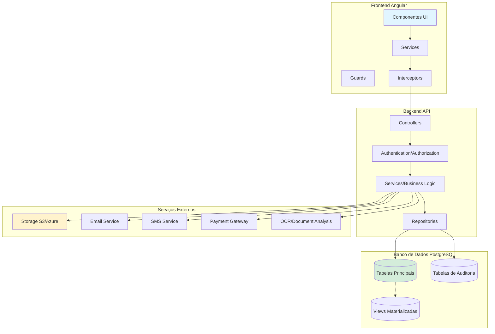
```mermaid
graph TB
    subgraph "Frontend Angular"
        A[Componentes UI]
        B[Services]
        C[Guards]
        D[Interceptors]
    end
    
    subgraph "Backend API"
        E[Controllers]
        F[Services/Business Logic]
        G[Repositories]
        H[Authentication/Authorization]
    end
    
    subgraph "Banco de Dados PostgreSQL"
        I[(Tabelas Principais)]
        J[(Tabelas de Auditoria)]
        K[(Views Materializadas)]
    end
    
    subgraph "Serviços Externos"
        L[Storage S3/Azure]
        M[Email Service]
        N[SMS Service]
        O[Payment Gateway]
        P[OCR/Document Analysis]
    end
    
    A --> B
    B --> D
    D --> E
    
    E --> H
    H --> F
    F --> G
    G --> I
    G --> J
    
    F --> L
    F --> M
    F --> N
    F --> O
    F --> P
    
    I -.-> K
    
    style A fill:#e1f5ff
    style I fill:#d4edda
    style L fill:#fff3cd
```

---

## Diagrama de Implantação

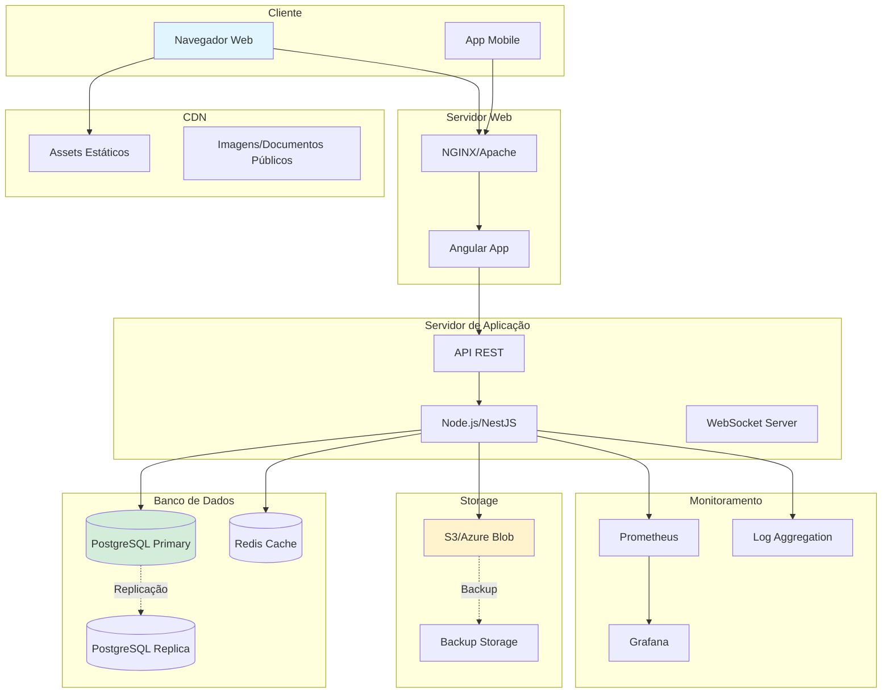
```mermaid
graph TB
    subgraph "Cliente"
        A[Navegador Web]
        B[App Mobile]
    end
    
    subgraph "CDN"
        C[Assets Estáticos]
        D[Imagens/Documentos Públicos]
    end
    
    subgraph "Servidor Web"
        E[NGINX/Apache]
        F[Angular App]
    end
    
    subgraph "Servidor de Aplicação"
        G[Node.js/NestJS]
        H[API REST]
        I[WebSocket Server]
    end
    
    subgraph "Banco de Dados"
        J[(PostgreSQL Primary)]
        K[(PostgreSQL Replica)]
        L[(Redis Cache)]
    end
    
    subgraph "Storage"
        M[S3/Azure Blob]
        N[Backup Storage]
    end
    
    subgraph "Monitoramento"
        O[Prometheus]
        P[Grafana]
        Q[Log Aggregation]
    end
    
    A --> C
    A --> E
    B --> E
    
    E --> F
    F --> H
    
    H --> G
    G --> J
    G --> L
    J -.->|Replicação| K
    
    G --> M
    M -.->|Backup| N
    
    G --> O
    O --> P
    G --> Q
    
    style A fill:#e1f5ff
    style J fill:#d4edda
    style M fill:#fff3cd
```

---

## Legenda de Cardinalidades

| Notação | Significado | Exemplo |
|---------|-------------|---------|
| `\|\|--o{` | Um para muitos | Um cliente possui muitos processos |
| `\|\|--\|\|` | Um para um | Um usuário é um cliente |
| `o{--o{` | Muitos para muitos | Advogados vinculados a sindicados |
| `\|\|--o\|` | Um para zero ou um | Processo pode ter um advogado |

---

## Como Usar Estes Diagramas

### 1. Visualização no GitHub
Os diagramas Mermaid são renderizados automaticamente no GitHub ao visualizar arquivos `.md`.

### 2. Visualização no VS Code
- Instale a extensão "Markdown Preview Mermaid Support"
- Abra o preview do arquivo Markdown

### 3. Exportar como Imagem
Use ferramentas online:
- [Mermaid Live Editor](https://mermaid.live/)
- [Mermaid Chart](https://www.mermaidchart.com/)

### 4. Integração em Documentação
- Pode ser incluído em wikis, Confluence, Notion
- Exportável para PNG, SVG, PDF

---

## Próximas Etapas

1. ✅ Diagramas ER criados
2. ⬜ Validar relacionamentos com equipe
3. ⬜ Criar diagramas de casos de uso
4. ⬜ Documentar regras de negócio específicas
5. ⬜ Criar diagramas de atividades para processos complexos

---

**Documento criado em**: 2024
**Ferramenta**: Mermaid.js
**Versão**: 1.0

