# Modelagem de Dados - Plataforma Jurídica
## PostgreSQL Database Design

---

## 📋 Índice

1. [Visão Geral](#visão-geral)
2. [Diagrama de Relacionamentos](#diagrama-de-relacionamentos)
3. [Tabelas Principais](#tabelas-principais)
4. [Tabelas de Suporte](#tabelas-de-suporte)
5. [Índices e Performance](#índices-e-performance)
6. [Triggers e Procedures](#triggers-e-procedures)
7. [Considerações de Segurança](#considerações-de-segurança)

---

## Visão Geral

Esta modelagem de dados foi desenvolvida para suportar uma plataforma jurídica completa que gerencia:
- **Usuários**: Clientes (PF/PJ), Advogados e Administradores
- **Processos**: Gestão completa de processos jurídicos com **cadastro rápido**
- **Documentos**: Armazenamento e versionamento de documentos
- **Comunicação**: Chat e mensagens entre usuários
- **Verificação**: Sistema de verificação de identidade e documentos
- **LGPD**: Termos e consentimentos conforme legislação

### 🚀 Fluxo de Cadastro Rápido pelo Cliente

O sistema suporta **cadastro rápido de processos pelo próprio cliente**, facilitando o onboarding:

1. **Cliente cria o processo primeiro** sem precisar se cadastrar
   - Preenche dados básicos: nome, email, telefone, CPF/CNPJ, tipo de processo
   - Sistema gera token de sessão único
   - Processo criado com status `cadastro_pendente` e `cliente_id = NULL`

2. **Cliente é redirecionado para completar cadastro**
   - Sistema detecta processo pendente por email ou token de sessão
   - Cliente preenche todos os dados completos (endereço, documentos, etc.)

3. **Vinculação automática após cadastro**
   - Função `vincular_cliente_processo()` busca processos pendentes pelo email
   - Sistema vincula automaticamente todos os processos do cliente
   - Status muda para `aberto`
   - Dados temporários são limpos

4. **Cliente é redirecionado para visualizar processo**
   - Processo fica disponível na área do cliente
   - Aguarda atribuição de advogados

5. **Atribuição de múltiplos advogados**
   - Admin/Cliente pode atribuir vários advogados ao processo
   - Cada advogado recebe notificação

6. **Advogados preenchem propostas**
   - Cada advogado preenche detalhes: honorários, estratégia, prazos, condições
   - Proposta enviada para análise do cliente

7. **Cliente avalia e escolhe**
   - Cliente visualiza todas as propostas recebidas
   - Pode aprovar um ou mais advogados
   - Processo muda para status 'em_andamento' quando advogado aceito

Este fluxo reduz fricção no primeiro contato e permite que clientes comparem propostas antes de escolher.

### Tecnologias Recomendadas
- **PostgreSQL** 14+ (recursos de JSONB, índices GIN, particionamento)
- **UUID** para chaves primárias
- **Timestamps** com timezone
- **Soft Delete** para auditoria

---

## Diagrama de Relacionamentos

> 📊 **Nota**: Para diagramas ER interativos e detalhados em formato Mermaid, consulte o arquivo [DIAGRAMAS_ER.md](./DIAGRAMAS_ER.md)

### Diagrama Simplificado (Texto)

```
┌─────────────────┐
│                 │
│   │usuarios     │
└────────┬────────┘
         │
    ┌────┴────┬──────────┬──────────┐
    │         │          │          │
┌───▼───┐ ┌──▼───┐  ┌──▼────┐      │
│clientes│advogados││ admins │     │
└───┬───┘ └──┬───┘  └────────┘     │
    │        │                     │
    │   ┌────┴──────────┐          │
    │   │               │          │
    │ ┌─▼──────────┐    │          │
    └─►  processos  │    │          │
      └─┬──────────┘    │          │
        │               │          │
    ┌───┴────┬──────────┼──────────┼──────┐
    │        │          │          │      │
┌───▼───┐ ┌─▼───────┐ ┌▼────────┐ ┌▼────▼───────┐
│documen│ │mensagens│ │atividades│ │verificacao  │
│  tos  │ └─────────┘ └──────────┘ │_identidade  │
└───────┘                          └─────────────┘
```

### Diagrama Visual (Mermaid)

```mermaid
erDiagram
    USUARIOS ||--o{ CLIENTES : "é"
    USUARIOS ||--o{ ADVOGADOS : "é"
    USUARIOS ||--o{ ADMINS : "é"
    
    CLIENTES ||--o{ PROCESSOS : "possui"
    
    PROCESSOS ||--o{ PROCESSO_ADVOGADOS : "tem"
    ADVOGADOS ||--o{ PROCESSO_ADVOGADOS : "atende"
    PROCESSO_ADVOGADOS ||--o{ PROPOSTAS_ADVOGADOS : "possui"
    
    PROCESSOS ||--o{ DOCUMENTOS : "contém"
    PROCESSOS ||--o{ MENSAGENS : "contém"
    PROCESSOS ||--o{ PROCESSO_ATIVIDADES : "registra"
    PROCESSOS ||--o{ PAGAMENTOS : "gera"
    PROCESSOS ||--o{ AVALIACOES : "gera"
    
    DOCUMENTOS ||--o{ DOCUMENTO_HISTORICO : "possui"
    
    USUARIOS ||--o{ TERMOS_LGPD : "aceita"
    TERMOS_LGPD ||--o{ CONSENTIMENTOS_LGPD : "contém"
    
    USUARIOS ||--o{ VERIFICACAO_IDENTIDADE : "submete"
    VERIFICACAO_IDENTIDADE ||--o{ DOCUMENTOS_VERIFICACAO : "contém"
```



---

## Tabelas Principais

### 1. `usuarios` (Tabela Pai - Herança)

Tabela principal que armazena dados comuns de todos os tipos de usuários.

```sql
CREATE TABLE usuarios (
    id UUID PRIMARY KEY DEFAULT gen_random_uuid(),
    nome VARCHAR(255) NOT NULL,
    email VARCHAR(255) NOT NULL UNIQUE,
    senha_hash VARCHAR(255) NOT NULL,
    telefone VARCHAR(20),
    tipo_usuario VARCHAR(20) NOT NULL CHECK (tipo_usuario IN ('cliente', 'advogado', 'admin')),
    status VARCHAR(20) NOT NULL DEFAULT 'pendente' CHECK (status IN ('ativo', 'inativo', 'pendente')),
    foto_perfil_url TEXT,
    
    -- Endereço
    cep VARCHAR(10),
    endereco VARCHAR(255),
    numero VARCHAR(20),
    complemento VARCHAR(100),
    bairro VARCHAR(100),
    cidade VARCHAR(100),
    estado VARCHAR(2),
    
    -- Controle e auditoria
    data_cadastro TIMESTAMP WITH TIME ZONE NOT NULL DEFAULT NOW(),
    data_atualizacao TIMESTAMP WITH TIME ZONE DEFAULT NOW(),
    ultimo_acesso TIMESTAMP WITH TIME ZONE,
    email_verificado BOOLEAN DEFAULT FALSE,
    data_verificacao_email TIMESTAMP WITH TIME ZONE,
    telefone_verificado BOOLEAN DEFAULT FALSE,
    
    -- Soft delete
    deletado BOOLEAN DEFAULT FALSE,
    data_delecao TIMESTAMP WITH TIME ZONE,
    
    -- Metadados
    metadata JSONB DEFAULT '{}'::jsonb,
    
    -- Índices
    CONSTRAINT email_lowercase CHECK (email = LOWER(email))
);

-- Índices para usuarios
CREATE INDEX idx_usuarios_email ON usuarios(email) WHERE deletado = FALSE;
CREATE INDEX idx_usuarios_tipo ON usuarios(tipo_usuario) WHERE deletado = FALSE;
CREATE INDEX idx_usuarios_status ON usuarios(status) WHERE deletado = FALSE;
CREATE INDEX idx_usuarios_cadastro ON usuarios(data_cadastro DESC);
CREATE INDEX idx_usuarios_metadata ON usuarios USING GIN(metadata);
```

**Explicação**: Tabela central do sistema usando pattern de herança. Armazena dados comuns a todos os usuários (clientes, advogados, admins). O campo `tipo_usuario` determina qual tabela específica consultar para dados adicionais.

---

### 2. `clientes`

Dados específicos de clientes (pessoas físicas ou jurídicas).

```sql
CREATE TABLE clientes (
    id UUID PRIMARY KEY REFERENCES usuarios(id) ON DELETE CASCADE,
    cpf VARCHAR(14) UNIQUE,
    cnpj VARCHAR(18) UNIQUE,
    tipo_pessoa VARCHAR(2) NOT NULL CHECK (tipo_pessoa IN ('PF', 'PJ')),
    razao_social VARCHAR(255), -- Para PJ
    nome_responsavel VARCHAR(255), -- Para PJ
    verificado BOOLEAN DEFAULT FALSE,
    data_verificacao TIMESTAMP WITH TIME ZONE,
    
    -- Informações adicionais
    data_nascimento DATE, -- Para PF
    profissao VARCHAR(100),
    estado_civil VARCHAR(50),
    rg VARCHAR(20),
    orgao_expedidor VARCHAR(10),
    
    -- Controle
    created_at TIMESTAMP WITH TIME ZONE DEFAULT NOW(),
    updated_at TIMESTAMP WITH TIME ZONE DEFAULT NOW(),
    
    CONSTRAINT cpf_cnpj_check CHECK (
        (tipo_pessoa = 'PF' AND cpf IS NOT NULL AND cnpj IS NULL) OR
        (tipo_pessoa = 'PJ' AND cnpj IS NOT NULL AND cpf IS NULL)
    )
);

CREATE INDEX idx_clientes_cpf ON clientes(cpf) WHERE cpf IS NOT NULL;
CREATE INDEX idx_clientes_cnpj ON clientes(cnpj) WHERE cnpj IS NOT NULL;
CREATE INDEX idx_clientes_verificado ON clientes(verificado);
```

**Explicação**: Armazena informações específicas de clientes. Suporta tanto pessoa física (CPF) quanto jurídica (CNPJ) com validação através de constraint. Campo `verificado` indica se passou pelo processo de verificação de identidade.

---

### 3. `advogados`

Dados específicos de advogados.

```sql
CREATE TABLE advogados (
    id UUID PRIMARY KEY REFERENCES usuarios(id) ON DELETE CASCADE,
    numero_oab VARCHAR(20) NOT NULL,
    uf_oab VARCHAR(2) NOT NULL,
    situacao_oab VARCHAR(20) NOT NULL DEFAULT 'ativo' CHECK (situacao_oab IN ('ativo', 'suspenso', 'cancelado')),
    data_inscricao_oab DATE,
    especialidades TEXT[], -- Array de especialidades
    verificado BOOLEAN DEFAULT FALSE,
    data_verificacao TIMESTAMP WITH TIME ZONE,
    verificado_por UUID REFERENCES usuarios(id),
    
    -- Avaliações e métricas
    avaliacao_media DECIMAL(3, 2) DEFAULT 0.0 CHECK (avaliacao_media >= 0 AND avaliacao_media <= 5),
    total_avaliacoes INTEGER DEFAULT 0,
    total_processos INTEGER DEFAULT 0,
    processos_ativos INTEGER DEFAULT 0,
    
    -- Disponibilidade
    disponivel_novos_casos BOOLEAN DEFAULT TRUE,
    capacidade_maxima_processos INTEGER DEFAULT 50,
    
    -- Informações profissionais
    biografia TEXT,
    formacao_academica JSONB DEFAULT '[]'::jsonb, -- Array de formações
    experiencia_anos INTEGER,
    areas_atuacao TEXT[],
    
    -- Dados bancários (para pagamentos)
    banco VARCHAR(100),
    agencia VARCHAR(10),
    conta VARCHAR(20),
    tipo_conta VARCHAR(20) CHECK (tipo_conta IN ('corrente', 'poupanca')),
    pix_chave VARCHAR(255),
    
    created_at TIMESTAMP WITH TIME ZONE DEFAULT NOW(),
    updated_at TIMESTAMP WITH TIME ZONE DEFAULT NOW(),
    
    CONSTRAINT oab_unica UNIQUE (numero_oab, uf_oab)
);

CREATE INDEX idx_advogados_oab ON advogados(numero_oab, uf_oab);
CREATE INDEX idx_advogados_verificado ON advogados(verificado);
CREATE INDEX idx_advogados_disponivel ON advogados(disponivel_novos_casos) WHERE disponivel_novos_casos = TRUE;
CREATE INDEX idx_advogados_especialidades ON advogados USING GIN(especialidades);
CREATE INDEX idx_advogados_areas_atuacao ON advogados USING GIN(areas_atuacao);
```

**Explicação**: Tabela de advogados com informações da OAB, especialidades e métricas de desempenho. Usa arrays do PostgreSQL para especialidades e JSONB para formação acadêmica (estrutura flexível). Inclui dados bancários para sistema de pagamentos.

---

### 4. `admins`

Dados específicos de administradores da plataforma.

```sql
CREATE TABLE admins (
    id UUID PRIMARY KEY REFERENCES usuarios(id) ON DELETE CASCADE,
    nivel_permissao VARCHAR(20) NOT NULL DEFAULT 'operador' CHECK (nivel_permissao IN ('super_admin', 'admin', 'operador', 'suporte')),
    departamento VARCHAR(100),
    cargo VARCHAR(100),
    permissoes JSONB DEFAULT '{}'::jsonb, -- Permissões específicas
    
    -- Auditoria de ações
    total_acoes_realizadas INTEGER DEFAULT 0,
    ultima_acao_data TIMESTAMP WITH TIME ZONE,
    
    created_at TIMESTAMP WITH TIME ZONE DEFAULT NOW(),
    updated_at TIMESTAMP WITH TIME ZONE DEFAULT NOW()
);

CREATE INDEX idx_admins_nivel ON admins(nivel_permissao);
CREATE INDEX idx_admins_permissoes ON admins USING GIN(permissoes);
```

**Explicação**: Administradores da plataforma com diferentes níveis de permissão. JSONB `permissoes` permite controle granular de acesso a funcionalidades específicas.

---

### 5. `processos`

Tabela central de processos jurídicos com suporte a **cadastro rápido**.

```sql
CREATE TABLE processos (
    id UUID PRIMARY KEY DEFAULT gen_random_uuid(),
    numero_processo VARCHAR(50) UNIQUE, -- Número do processo judicial (se houver)
    titulo VARCHAR(255) NOT NULL,
    descricao TEXT NOT NULL,
    
    -- Tipo e status
    tipo VARCHAR(30) NOT NULL CHECK (tipo IN ('trabalhista', 'civil', 'criminal', 'familia', 'tributario', 'empresarial')),
    status VARCHAR(30) NOT NULL DEFAULT 'cadastro_pendente' CHECK (status IN ('cadastro_pendente', 'aberto', 'em_andamento', 'aguardando_cliente', 'aguardando_aprovacao', 'concluido', 'arquivado', 'rejeitado')),
    
    -- Relacionamentos
    cliente_id UUID REFERENCES clientes(id) ON DELETE RESTRICT, -- NULL para cadastro rápido
    advogado_id UUID REFERENCES advogados(id) ON DELETE SET NULL,
    criado_por UUID REFERENCES usuarios(id), -- NULL quando cliente ainda não está cadastrado
    
    -- Dados temporários do cliente (para cadastro rápido)
    cliente_temp_nome VARCHAR(255) NOT NULL, -- Nome temporário até criar o cliente
    cliente_temp_email VARCHAR(255) NOT NULL, -- Email usado para vincular após cadastro
    cliente_temp_telefone VARCHAR(20),
    cliente_temp_cpf_cnpj VARCHAR(18) NOT NULL, -- CPF ou CNPJ sem formatação
    cliente_temp_tipo_pessoa VARCHAR(2) NOT NULL CHECK (cliente_temp_tipo_pessoa IN ('PF', 'PJ')),
    
    -- Rastreamento de sessão (para vincular após cadastro)
    sessao_token VARCHAR(255), -- Token único para vincular processo ao cliente após cadastro
    sessao_ip INET, -- IP de origem do cadastro rápido
    
    -- Valores e custos
    valor_causa DECIMAL(15, 2),
    valor_pretendido DECIMAL(15, 2),
    custos_envolvidos DECIMAL(15, 2) DEFAULT 0,
    honorarios DECIMAL(15, 2),
    forma_pagamento_honorarios VARCHAR(50), -- fixo, porcentagem, êxito
    
    -- Datas
    data_criacao TIMESTAMP WITH TIME ZONE NOT NULL DEFAULT NOW(),
    data_atribuicao TIMESTAMP WITH TIME ZONE,
    data_inicio TIMESTAMP WITH TIME ZONE,
    data_limite TIMESTAMP WITH TIME ZONE,
    prazo_estimado TIMESTAMP WITH TIME ZONE,
    data_conclusao TIMESTAMP WITH TIME ZONE,
    
    -- Prioridade e urgência
    urgencia VARCHAR(20) NOT NULL DEFAULT 'media' CHECK (urgencia IN ('baixa', 'media', 'alta')),
    prioridade VARCHAR(20) DEFAULT 'normal' CHECK (prioridade IN ('baixa', 'normal', 'alta', 'critica')),
    
    -- Jurisdição
    jurisdicao VARCHAR(30) CHECK (jurisdicao IN ('federal', 'estadual', 'municipal', 'trabalhista', 'eleitoral', 'militar')),
    tribunal VARCHAR(255),
    comarca VARCHAR(100),
    vara VARCHAR(100),
    localidade VARCHAR(255),
    
    -- Contadores
    documentos_count INTEGER DEFAULT 0,
    mensagens_count INTEGER DEFAULT 0,
    mensagens_nao_lidas INTEGER DEFAULT 0,
    atividades_count INTEGER DEFAULT 0,
    
    -- Informações adicionais
    observacoes TEXT,
    instrucoes TEXT,
    tags TEXT[],
    
    -- Controle
    updated_at TIMESTAMP WITH TIME ZONE DEFAULT NOW(),
    deletado BOOLEAN DEFAULT FALSE,
    data_delecao TIMESTAMP WITH TIME ZONE,
    
    -- Metadados flexíveis
    metadata JSONB DEFAULT '{}'::jsonb,
    
    -- Constraint: Deve ter cliente_id OU dados temporários completos
    CONSTRAINT cliente_obrigatorio CHECK (
        cliente_id IS NOT NULL OR 
        (cliente_temp_nome IS NOT NULL AND 
         cliente_temp_email IS NOT NULL AND 
         cliente_temp_cpf_cnpj IS NOT NULL AND 
         cliente_temp_tipo_pessoa IS NOT NULL)
    ),
    -- Constraint: Se tem cliente_id, não deve ter dados temporários
    CONSTRAINT cliente_ou_temp CHECK (
        (cliente_id IS NULL) OR 
        (cliente_id IS NOT NULL AND cliente_temp_nome IS NULL)
    )
);

CREATE INDEX idx_processos_cliente ON processos(cliente_id) WHERE deletado = FALSE AND cliente_id IS NOT NULL;
CREATE INDEX idx_processos_advogado ON processos(advogado_id) WHERE deletado = FALSE;
CREATE INDEX idx_processos_status ON processos(status) WHERE deletado = FALSE;
CREATE INDEX idx_processos_cadastro_pendente ON processos(status) WHERE status = 'cadastro_pendente' AND deletado = FALSE;
CREATE INDEX idx_processos_sem_cliente ON processos(data_criacao) WHERE cliente_id IS NULL AND deletado = FALSE;
CREATE INDEX idx_processos_sessao_token ON processos(sessao_token) WHERE sessao_token IS NOT NULL;
CREATE INDEX idx_processos_temp_email ON processos(cliente_temp_email) WHERE cliente_id IS NULL;
CREATE INDEX idx_processos_temp_cpf_cnpj ON processos(cliente_temp_cpf_cnpj) WHERE cliente_id IS NULL;
CREATE INDEX idx_processos_tipo ON processos(tipo) WHERE deletado = FALSE;
CREATE INDEX idx_processos_urgencia ON processos(urgencia) WHERE deletado = FALSE;
CREATE INDEX idx_processos_criacao ON processos(data_criacao DESC);
CREATE INDEX idx_processos_prazo ON processos(prazo_estimado) WHERE status NOT IN ('concluido', 'arquivado');
CREATE INDEX idx_processos_tags ON processos USING GIN(tags);
CREATE INDEX idx_processos_metadata ON processos USING GIN(metadata);
CREATE INDEX idx_processos_busca ON processos USING GIN(to_tsvector('portuguese', titulo || ' ' || COALESCE(descricao, '')));
```

**Explicação**: Tabela principal de processos jurídicos com **suporte a cadastro rápido pelo cliente**. 

**Fluxo de Cadastro Rápido pelo Cliente:**
1. Cliente cria processo sem estar cadastrado (preenche dados básicos)
2. Sistema gera `sessao_token` único e registra IP de origem
3. Processo criado com `cliente_id = NULL`, `criado_por = NULL`, status `cadastro_pendente`
4. Dados temporários armazenados em `cliente_temp_*` (NOT NULL)
5. Cliente é redirecionado para completar cadastro
6. Após cadastro, função `vincular_cliente_processo()` busca processos por email/token
7. Sistema vincula automaticamente, limpa dados temporários e muda status para `aberto`

**Fluxo de Atribuição e Aprovação:**
1. Processo fica com status `aberto` aguardando atribuição
2. Admin/Cliente atribui múltiplos advogados (tabela `processo_advogados`)
3. Cada advogado preenche sua proposta (tabela `propostas_advogados`)
4. Advogado envia proposta → status muda para `aguardando_aprovacao`
5. Cliente visualiza todas as propostas e escolhe qual(is) aprovar
6. Quando cliente aprova e advogado aceita → status muda para `em_andamento`

**Constraints:**
- `cliente_obrigatorio`: Deve ter cliente_id OU todos os dados temporários obrigatórios
- `cliente_ou_temp`: Não pode ter cliente_id E dados temporários simultaneamente

**Índices:**
- Busca por email para vinculação automática
- Busca por token de sessão
- Listagem de processos pendentes
- Listagem de propostas aguardando aprovação

Soft delete para auditoria.

---

### 6. `processo_atividades`

Histórico de atividades/eventos do processo.

```sql
CREATE TABLE processo_atividades (
    id UUID PRIMARY KEY DEFAULT gen_random_uuid(),
    processo_id UUID NOT NULL REFERENCES processos(id) ON DELETE CASCADE,
    
    -- Tipo de atividade
    tipo VARCHAR(50) NOT NULL CHECK (tipo IN ('criacao', 'atribuicao', 'mensagem', 'documento', 'status_change', 'comentario', 'prazo', 'audiencia', 'sentenca', 'recurso')),
    
    -- Dados da atividade
    titulo VARCHAR(255) NOT NULL,
    descricao TEXT,
    
    -- Usuário responsável
    usuario_id UUID NOT NULL REFERENCES usuarios(id),
    usuario_nome VARCHAR(255) NOT NULL,
    usuario_tipo VARCHAR(20) NOT NULL,
    
    -- Metadados específicos da atividade
    metadata JSONB DEFAULT '{}'::jsonb,
    
    -- Controle
    data_atividade TIMESTAMP WITH TIME ZONE NOT NULL DEFAULT NOW(),
    visivel_cliente BOOLEAN DEFAULT TRUE
);

CREATE INDEX idx_atividades_processo ON processo_atividades(processo_id, data_atividade DESC);
CREATE INDEX idx_atividades_tipo ON processo_atividades(tipo);
CREATE INDEX idx_atividades_usuario ON processo_atividades(usuario_id);
CREATE INDEX idx_atividades_data ON processo_atividades(data_atividade DESC);
CREATE INDEX idx_atividades_metadata ON processo_atividades USING GIN(metadata);
```

**Explicação**: Timeline de todas as atividades do processo. Cada mudança de status, upload de documento, mensagem importante gera uma entrada aqui. Campo `visivel_cliente` controla o que o cliente pode ver.

---

### 7. `processo_advogados` (N:N)

Relacionamento N:N entre processos e advogados, permitindo múltiplos advogados por processo.

```sql
CREATE TABLE processo_advogados (
    id UUID PRIMARY KEY DEFAULT gen_random_uuid(),
    processo_id UUID NOT NULL REFERENCES processos(id) ON DELETE CASCADE,
    advogado_id UUID NOT NULL REFERENCES advogados(id) ON DELETE CASCADE,
    
    -- Status da atribuição/aprovação
    status VARCHAR(30) NOT NULL DEFAULT 'pendente' CHECK (status IN ('pendente', 'proposta_enviada', 'aguardando_aprovacao_cliente', 'aprovado_cliente', 'rejeitado_cliente', 'aceito', 'recusado_advogado', 'cancelado')),
    
    -- Quem atribuiu
    atribuido_por UUID REFERENCES usuarios(id),
    atribuido_por_nome VARCHAR(255),
    atribuido_por_tipo VARCHAR(20),
    data_atribuicao TIMESTAMP WITH TIME ZONE NOT NULL DEFAULT NOW(),
    
    -- Aprovação do cliente
    aprovado_por_cliente BOOLEAN DEFAULT FALSE,
    data_aprovacao_cliente TIMESTAMP WITH TIME ZONE,
    data_rejeicao_cliente TIMESTAMP WITH TIME ZONE,
    motivo_rejeicao_cliente TEXT,
    
    -- Aceite do advogado
    aceito_por_advogado BOOLEAN DEFAULT FALSE,
    data_aceite_advogado TIMESTAMP WITH TIME ZONE,
    data_recusa_advogado TIMESTAMP WITH TIME ZONE,
    motivo_recusa_advogado TEXT,
    
    -- Flag para advogado principal
    principal BOOLEAN DEFAULT FALSE,
    
    CONSTRAINT processo_advogado_unico UNIQUE (processo_id, advogado_id)
);
```

**Explicação**: Permite que múltiplos advogados sejam atribuídos a um processo. Cada relacionamento tem seu próprio status de aprovação. O cliente pode aprovar um ou mais advogados. Campo `principal` indica se é o advogado principal (quando múltiplos são aceitos).

---

### 8. `propostas_advogados`

Propostas detalhadas de cada advogado para um processo.

```sql
CREATE TABLE propostas_advogados (
    id UUID PRIMARY KEY DEFAULT gen_random_uuid(),
    processo_advogado_id UUID NOT NULL REFERENCES processo_advogados(id) ON DELETE CASCADE,
    processo_id UUID NOT NULL REFERENCES processos(id) ON DELETE CASCADE,
    advogado_id UUID NOT NULL REFERENCES advogados(id) ON DELETE CASCADE,
    
    -- Valores da proposta
    valor_honorarios DECIMAL(15, 2) NOT NULL,
    forma_pagamento VARCHAR(50) NOT NULL CHECK (forma_pagamento IN ('fixo', 'porcentagem', 'exito', 'mensal', 'hora_trabalhada', 'combinado')),
    porcentagem_exito DECIMAL(5, 2),
    
    -- Custas e despesas
    responsavel_custas VARCHAR(30),
    responsavel_despesas VARCHAR(30),
    
    -- Prazo e condições
    prazo_estimado_meses INTEGER,
    prazo_estimado_dias INTEGER,
    condicoes_especiais TEXT,
    
    -- Descrição da proposta
    descricao_proposta TEXT NOT NULL,
    estrategia_acao TEXT,
    pontos_fortes TEXT,
    riscos_identificados TEXT,
    expectativa_resultado TEXT,
    
    -- Status da proposta
    status VARCHAR(30) NOT NULL DEFAULT 'rascunho' CHECK (status IN ('rascunho', 'enviada', 'em_analise_cliente', 'aprovada', 'rejeitada', 'expirada')),
    
    -- Controle de versão
    versao INTEGER DEFAULT 1,
    proposta_anterior_id UUID REFERENCES propostas_advogados(id),
    
    aprovado_por_cliente BOOLEAN DEFAULT FALSE,
    data_envio TIMESTAMP WITH TIME ZONE,
    data_aprovacao TIMESTAMP WITH TIME ZONE
);
```

**Explicação**: Cada advogado preenche uma proposta detalhada com honorários, estratégia, prazos e condições. Suporta versionamento (advogado pode atualizar e enviar nova versão). Cliente pode aprovar ou rejeitar cada proposta.

---

### 9. `documentos`

Armazenamento de documentos do processo.

```sql
CREATE TABLE documentos (
    id UUID PRIMARY KEY DEFAULT gen_random_uuid(),
    processo_id UUID NOT NULL REFERENCES processos(id) ON DELETE CASCADE,
    
    -- Informações do arquivo
    nome VARCHAR(255) NOT NULL,
    nome_original VARCHAR(255) NOT NULL,
    caminho_arquivo TEXT NOT NULL, -- Caminho no storage (S3, disco, etc)
    url_publica TEXT,
    
    -- Tipo e categoria
    tipo_arquivo VARCHAR(10) NOT NULL CHECK (tipo_arquivo IN ('pdf', 'doc', 'docx', 'txt', 'jpg', 'jpeg', 'png', 'gif', 'xls', 'xlsx', 'zip', 'rar', 'outros')),
    categoria VARCHAR(30) NOT NULL CHECK (categoria IN ('inicial', 'identificacao', 'comprovantes', 'contratos', 'peticoes', 'sentencas', 'evidencias', 'correspondencia', 'outros')),
    
    -- Tamanho e hash
    tamanho_bytes BIGINT NOT NULL,
    tamanho_formatado VARCHAR(20),
    checksum VARCHAR(64), -- SHA-256
    mime_type VARCHAR(100),
    
    -- Controle de versão
    versao INTEGER NOT NULL DEFAULT 1,
    documento_pai_id UUID REFERENCES documentos(id), -- Para versionamento
    
    -- Upload e status
    uploaded_by UUID NOT NULL REFERENCES usuarios(id),
    uploaded_by_nome VARCHAR(255) NOT NULL,
    uploaded_by_tipo VARCHAR(20) NOT NULL,
    status VARCHAR(30) NOT NULL DEFAULT 'disponivel' CHECK (status IN ('processando', 'disponivel', 'aprovado', 'rejeitado', 'arquivado')),
    
    -- Permissões e visibilidade
    publico BOOLEAN DEFAULT TRUE, -- Visível para cliente
    assinado BOOLEAN DEFAULT FALSE,
    
    -- Informações adicionais
    descricao TEXT,
    tags TEXT[],
    observacoes TEXT,
    
    -- Datas
    data_upload TIMESTAMP WITH TIME ZONE NOT NULL DEFAULT NOW(),
    data_modificacao TIMESTAMP WITH TIME ZONE,
    data_aprovacao TIMESTAMP WITH TIME ZONE,
    data_arquivamento TIMESTAMP WITH TIME ZONE,
    
    -- Soft delete
    deletado BOOLEAN DEFAULT FALSE,
    data_delecao TIMESTAMP WITH TIME ZONE,
    deletado_por UUID REFERENCES usuarios(id)
);

CREATE INDEX idx_documentos_processo ON documentos(processo_id) WHERE deletado = FALSE;
CREATE INDEX idx_documentos_categoria ON documentos(categoria);
CREATE INDEX idx_documentos_tipo ON documentos(tipo_arquivo);
CREATE INDEX idx_documentos_status ON documentos(status);
CREATE INDEX idx_documentos_upload ON documentos(data_upload DESC);
CREATE INDEX idx_documentos_publico ON documentos(publico);
CREATE INDEX idx_documentos_tags ON documentos USING GIN(tags);
CREATE INDEX idx_documentos_checksum ON documentos(checksum);
```

**Explicação**: Gerenciamento completo de documentos com versionamento, categorização e controle de acesso. Campo `checksum` evita duplicatas e garante integridade. `documento_pai_id` permite rastrear versões.

---

### 10. `documento_historico`

Histórico de ações em documentos (auditoria).

```sql
CREATE TABLE documento_historico (
    id UUID PRIMARY KEY DEFAULT gen_random_uuid(),
    documento_id UUID NOT NULL REFERENCES documentos(id) ON DELETE CASCADE,
    
    -- Ação realizada
    acao VARCHAR(30) NOT NULL CHECK (acao IN ('upload', 'download', 'visualizacao', 'edicao', 'exclusao', 'aprovacao', 'rejeicao', 'compartilhamento')),
    
    -- Usuário
    usuario_id UUID NOT NULL REFERENCES usuarios(id),
    usuario_nome VARCHAR(255) NOT NULL,
    usuario_tipo VARCHAR(20) NOT NULL,
    
    -- Detalhes
    detalhes TEXT,
    ip_address INET,
    user_agent TEXT,
    
    -- Data
    data_acao TIMESTAMP WITH TIME ZONE NOT NULL DEFAULT NOW()
);

CREATE INDEX idx_doc_historico_documento ON documento_historico(documento_id, data_acao DESC);
CREATE INDEX idx_doc_historico_usuario ON documento_historico(usuario_id);
CREATE INDEX idx_doc_historico_acao ON documento_historico(acao);
CREATE INDEX idx_doc_historico_data ON documento_historico(data_acao DESC);

-- Particionamento por data (recomendado para alto volume)
-- CREATE TABLE documento_historico_2024_01 PARTITION OF documento_historico
-- FOR VALUES FROM ('2024-01-01') TO ('2024-02-01');
```

**Explicação**: Auditoria completa de todas as ações em documentos. Armazena IP e user agent para compliance. Pode ser particionado por data para melhor performance em grandes volumes.

---

### 11. `mensagens`

Sistema de mensagens/chat entre usuários.

```sql
CREATE TABLE mensagens (
    id UUID PRIMARY KEY DEFAULT gen_random_uuid(),
    processo_id UUID NOT NULL REFERENCES processos(id) ON DELETE CASCADE,
    
    -- Remetente
    remetente_id UUID NOT NULL REFERENCES usuarios(id),
    remetente_nome VARCHAR(255) NOT NULL,
    remetente_tipo VARCHAR(20) NOT NULL CHECK (remetente_tipo IN ('cliente', 'advogado', 'admin', 'sindicado')),
    
    -- Destinatário (pode ser nulo para mensagens de grupo)
    destinatario_id UUID REFERENCES usuarios(id),
    destinatario_nome VARCHAR(255),
    destinatario_tipo VARCHAR(20) CHECK (destinatario_tipo IN ('cliente', 'advogado', 'admin', 'sindicado')),
    
    -- Conteúdo
    conteudo TEXT NOT NULL,
    tipo_mensagem VARCHAR(20) NOT NULL DEFAULT 'texto' CHECK (tipo_mensagem IN ('texto', 'arquivo', 'imagem', 'sistema')),
    
    -- Anexo (se houver)
    anexo_nome VARCHAR(255),
    anexo_url TEXT,
    anexo_tipo VARCHAR(100),
    anexo_tamanho BIGINT,
    
    -- Status
    status VARCHAR(20) NOT NULL DEFAULT 'enviado' CHECK (status IN ('enviando', 'enviado', 'entregue', 'lido', 'erro')),
    lida BOOLEAN DEFAULT FALSE,
    data_envio TIMESTAMP WITH TIME ZONE NOT NULL DEFAULT NOW(),
    data_leitura TIMESTAMP WITH TIME ZONE,
    data_entrega TIMESTAMP WITH TIME ZONE,
    
    -- Edição
    editada BOOLEAN DEFAULT FALSE,
    data_edicao TIMESTAMP WITH TIME ZONE,
    
    -- Resposta
    mensagem_pai_id UUID REFERENCES mensagens(id), -- Para threads
    
    -- Soft delete
    deletada BOOLEAN DEFAULT FALSE,
    data_delecao TIMESTAMP WITH TIME ZONE
);

CREATE INDEX idx_mensagens_processo ON mensagens(processo_id, data_envio DESC) WHERE deletada = FALSE;
CREATE INDEX idx_mensagens_remetente ON mensagens(remetente_id);
CREATE INDEX idx_mensagens_destinatario ON mensagens(destinatario_id);
CREATE INDEX idx_mensagens_nao_lidas ON mensagens(processo_id, destinatario_id) WHERE lida = FALSE AND deletada = FALSE;
CREATE INDEX idx_mensagens_tipo ON mensagens(tipo_mensagem);
CREATE INDEX idx_mensagens_data ON mensagens(data_envio DESC);
```

**Explicação**: Sistema completo de mensagens com suporte a anexos, status de leitura e threads (respostas). Índice específico para mensagens não lidas melhora performance.

---

### 12. `termos_lgpd`

Aceite de termos e políticas LGPD.

```sql
CREATE TABLE termos_lgpd (
    id UUID PRIMARY KEY DEFAULT gen_random_uuid(),
    
    -- Usuário
    usuario_id UUID NOT NULL REFERENCES usuarios(id) ON DELETE CASCADE,
    usuario_nome VARCHAR(255) NOT NULL,
    usuario_email VARCHAR(255) NOT NULL,
    
    -- Versão do termo
    versao_termo VARCHAR(20) NOT NULL,
    tipo_termo VARCHAR(30) NOT NULL CHECK (tipo_termo IN ('termo_uso', 'politica_privacidade', 'consentimento_lgpd', 'termo_servico', 'cookies')),
    hash_termo VARCHAR(64) NOT NULL, -- Hash do conteúdo do termo
    
    -- Status
    status VARCHAR(30) NOT NULL DEFAULT 'pendente' CHECK (status IN ('pendente', 'aceito', 'rejeitado', 'revogado', 'expirado')),
    
    -- Datas
    data_aceite TIMESTAMP WITH TIME ZONE,
    data_expiracao TIMESTAMP WITH TIME ZONE,
    data_revogacao TIMESTAMP WITH TIME ZONE,
    
    -- Dados do aceite
    ip_aceite INET,
    user_agent_aceite TEXT,
    
    -- Observações
    observacoes TEXT,
    motivo_revogacao TEXT,
    
    created_at TIMESTAMP WITH TIME ZONE DEFAULT NOW()
);

CREATE INDEX idx_termos_usuario ON termos_lgpd(usuario_id);
CREATE INDEX idx_termos_tipo ON termos_lgpd(tipo_termo);
CREATE INDEX idx_termos_status ON termos_lgpd(status);
CREATE INDEX idx_termos_versao ON termos_lgpd(versao_termo);
CREATE INDEX idx_termos_aceite ON termos_lgpd(data_aceite DESC);
```

**Explicação**: Registro de aceite de termos conforme LGPD. Hash do termo garante que sabemos exatamente qual versão foi aceita. IP e user agent para prova legal.

---

### 13. `consentimentos_lgpd`

Consentimentos específicos LGPD do usuário.

```sql
CREATE TABLE consentimentos_lgpd (
    id UUID PRIMARY KEY DEFAULT gen_random_uuid(),
    termo_lgpd_id UUID NOT NULL REFERENCES termos_lgpd(id) ON DELETE CASCADE,
    
    -- Tipo de consentimento
    tipo_consentimento VARCHAR(50) NOT NULL CHECK (tipo_consentimento IN ('dados_pessoais', 'dados_sensiveis', 'marketing', 'cookies_funcionais', 'cookies_marketing', 'compartilhamento_dados', 'tratamento_automatizado')),
    descricao TEXT NOT NULL,
    
    -- Status
    obrigatorio BOOLEAN DEFAULT FALSE,
    aceito BOOLEAN DEFAULT FALSE,
    
    -- Datas
    data_aceite TIMESTAMP WITH TIME ZONE,
    data_revogacao TIMESTAMP WITH TIME ZONE,
    
    created_at TIMESTAMP WITH TIME ZONE DEFAULT NOW()
);

CREATE INDEX idx_consentimentos_termo ON consentimentos_lgpd(termo_lgpd_id);
CREATE INDEX idx_consentimentos_tipo ON consentimentos_lgpd(tipo_consentimento);
CREATE INDEX idx_consentimentos_aceito ON consentimentos_lgpd(aceito);
```

**Explicação**: Consentimentos granulares conforme LGPD. Permite que usuário aceite/rejeite diferentes tipos de uso de dados. Campo `obrigatorio` indica consentimentos necessários para uso da plataforma.

---

### 14. `log_termos_lgpd`

Log de ações relacionadas a termos LGPD.

```sql
CREATE TABLE log_termos_lgpd (
    id UUID PRIMARY KEY DEFAULT gen_random_uuid(),
    termo_lgpd_id UUID NOT NULL REFERENCES termos_lgpd(id) ON DELETE CASCADE,
    usuario_id UUID NOT NULL REFERENCES usuarios(id),
    
    -- Ação
    acao VARCHAR(30) NOT NULL CHECK (acao IN ('aceite', 'rejeicao', 'revogacao', 'visualizacao', 'download')),
    
    -- Dados
    data_acao TIMESTAMP WITH TIME ZONE NOT NULL DEFAULT NOW(),
    ip_origem INET,
    user_agent TEXT,
    detalhes TEXT
);

CREATE INDEX idx_log_termos_termo ON log_termos_lgpd(termo_lgpd_id, data_acao DESC);
CREATE INDEX idx_log_termos_usuario ON log_termos_lgpd(usuario_id);
CREATE INDEX idx_log_termos_acao ON log_termos_lgpd(acao);
CREATE INDEX idx_log_termos_data ON log_termos_lgpd(data_acao DESC);
```

**Explicação**: Auditoria completa de ações relacionadas a termos. Fundamental para compliance LGPD.

---

### 15. `verificacao_identidade`

Processo de verificação de identidade de usuários.

```sql
CREATE TABLE verificacao_identidade (
    id UUID PRIMARY KEY DEFAULT gen_random_uuid(),
    
    -- Usuário
    usuario_id UUID NOT NULL REFERENCES usuarios(id) ON DELETE CASCADE,
    usuario_nome VARCHAR(255) NOT NULL,
    usuario_email VARCHAR(255) NOT NULL,
    tipo_usuario VARCHAR(20) NOT NULL CHECK (tipo_usuario IN ('cliente', 'advogado')),
    
    -- Status
    status VARCHAR(30) NOT NULL DEFAULT 'pendente' CHECK (status IN ('pendente', 'em_analise', 'aprovado', 'rejeitado', 'documentos_pendentes')),
    
    -- Informações específicas (para advogados)
    numero_oab VARCHAR(20),
    uf_oab VARCHAR(2),
    situacao_oab VARCHAR(20),
    data_inscricao_oab DATE,
    
    -- Informações específicas (para clientes)
    tipo_pessoa VARCHAR(2) CHECK (tipo_pessoa IN ('PF', 'PJ')),
    documento VARCHAR(18), -- CPF ou CNPJ
    telefone_verificado BOOLEAN DEFAULT FALSE,
    email_verificado BOOLEAN DEFAULT FALSE,
    
    -- Análise
    analisado_por UUID REFERENCES usuarios(id),
    data_submissao TIMESTAMP WITH TIME ZONE NOT NULL DEFAULT NOW(),
    data_analise TIMESTAMP WITH TIME ZONE,
    
    -- Observações
    observacoes TEXT,
    motivo_rejeicao TEXT,
    
    -- Metadados
    metadata JSONB DEFAULT '{}'::jsonb
);

CREATE INDEX idx_verificacao_usuario ON verificacao_identidade(usuario_id);
CREATE INDEX idx_verificacao_status ON verificacao_identidade(status);
CREATE INDEX idx_verificacao_tipo ON verificacao_identidade(tipo_usuario);
CREATE INDEX idx_verificacao_analisado ON verificacao_identidade(analisado_por);
CREATE INDEX idx_verificacao_pendentes ON verificacao_identidade(status) WHERE status IN ('pendente', 'em_analise');
```

**Explicação**: Controle do processo de verificação de identidade. Armazena dados específicos de acordo com o tipo de usuário (OAB para advogados, CPF/CNPJ para clientes).

---

### 16. `documentos_verificacao`

Documentos enviados para verificação de identidade.

```sql
CREATE TABLE documentos_verificacao (
    id UUID PRIMARY KEY DEFAULT gen_random_uuid(),
    verificacao_id UUID NOT NULL REFERENCES verificacao_identidade(id) ON DELETE CASCADE,
    
    -- Tipo de documento
    tipo_documento VARCHAR(50) NOT NULL CHECK (tipo_documento IN ('rg', 'cpf', 'cnpj', 'comprovante_residencia', 'comprovante_renda', 'oab', 'foto_oab', 'selfie_documento', 'contrato_social', 'procuracao')),
    
    -- Arquivo
    nome VARCHAR(255) NOT NULL,
    url TEXT NOT NULL,
    tamanho_bytes BIGINT,
    
    -- Status
    status VARCHAR(30) NOT NULL DEFAULT 'pendente' CHECK (status IN ('pendente', 'aprovado', 'rejeitado', 'requer_reenvio')),
    
    -- Análise
    data_upload TIMESTAMP WITH TIME ZONE NOT NULL DEFAULT NOW(),
    data_analise TIMESTAMP WITH TIME ZONE,
    observacoes TEXT,
    motivo_rejeicao TEXT
);

CREATE INDEX idx_doc_verificacao_verificacao ON documentos_verificacao(verificacao_id);
CREATE INDEX idx_doc_verificacao_tipo ON documentos_verificacao(tipo_documento);
CREATE INDEX idx_doc_verificacao_status ON documentos_verificacao(status);
```

**Explicação**: Documentos específicos do processo de verificação. Separado da tabela principal de documentos pois tem ciclo de vida e validações diferentes.

---

### 17. `avaliacoes`

Avaliações de advogados pelos clientes.

```sql
CREATE TABLE avaliacoes (
    id UUID PRIMARY KEY DEFAULT gen_random_uuid(),
    processo_id UUID NOT NULL REFERENCES processos(id) ON DELETE CASCADE,
    advogado_id UUID NOT NULL REFERENCES advogados(id) ON DELETE CASCADE,
    cliente_id UUID NOT NULL REFERENCES clientes(id) ON DELETE CASCADE,
    
    -- Avaliação
    nota DECIMAL(3, 2) NOT NULL CHECK (nota >= 0 AND nota <= 5),
    
    -- Critérios específicos
    comunicacao INTEGER CHECK (comunicacao >= 1 AND comunicacao <= 5),
    conhecimento_tecnico INTEGER CHECK (conhecimento_tecnico >= 1 AND conhecimento_tecnico <= 5),
    prazo INTEGER CHECK (prazo >= 1 AND prazo <= 5),
    atendimento INTEGER CHECK (atendimento >= 1 AND atendimento <= 5),
    
    -- Comentário
    comentario TEXT,
    pontos_positivos TEXT,
    pontos_melhoria TEXT,
    
    -- Recomendação
    recomendaria BOOLEAN,
    
    -- Status
    aprovado BOOLEAN DEFAULT TRUE, -- Moderação
    publico BOOLEAN DEFAULT TRUE,
    
    -- Resposta do advogado
    resposta_advogado TEXT,
    data_resposta TIMESTAMP WITH TIME ZONE,
    
    -- Datas
    data_avaliacao TIMESTAMP WITH TIME ZONE NOT NULL DEFAULT NOW(),
    
    CONSTRAINT avaliacao_unica UNIQUE (processo_id, cliente_id)
);

CREATE INDEX idx_avaliacoes_advogado ON avaliacoes(advogado_id) WHERE aprovado = TRUE;
CREATE INDEX idx_avaliacoes_processo ON avaliacoes(processo_id);
CREATE INDEX idx_avaliacoes_cliente ON avaliacoes(cliente_id);
CREATE INDEX idx_avaliacoes_nota ON avaliacoes(nota DESC);
CREATE INDEX idx_avaliacoes_data ON avaliacoes(data_avaliacao DESC);
CREATE INDEX idx_avaliacoes_publicas ON avaliacoes(advogado_id) WHERE publico = TRUE AND aprovado = TRUE;
```

**Explicação**: Sistema de avaliações com múltiplos critérios. Permite moderação antes de publicação e resposta do advogado. Constraint garante uma avaliação por processo.

---

### 18. `notificacoes`

Sistema de notificações da plataforma.

```sql
CREATE TABLE notificacoes (
    id UUID PRIMARY KEY DEFAULT gen_random_uuid(),
    
    -- Destinatário
    usuario_id UUID NOT NULL REFERENCES usuarios(id) ON DELETE CASCADE,
    
    -- Tipo e categoria
    tipo VARCHAR(50) NOT NULL CHECK (tipo IN ('mensagem', 'documento', 'processo', 'agenda', 'assinatura', 'pagamento', 'sistema', 'avaliacao', 'verificacao')),
    categoria VARCHAR(30) CHECK (categoria IN ('info', 'sucesso', 'aviso', 'erro', 'urgente')),
    
    -- Conteúdo
    titulo VARCHAR(255) NOT NULL,
    mensagem TEXT NOT NULL,
    
    -- Dados relacionados
    processo_id UUID REFERENCES processos(id) ON DELETE CASCADE,
    documento_id UUID REFERENCES documentos(id) ON DELETE CASCADE,
    
    -- Link de ação
    link_acao TEXT,
    label_acao VARCHAR(100),
    
    -- Status
    lida BOOLEAN DEFAULT FALSE,
    data_leitura TIMESTAMP WITH TIME ZONE,
    
    -- Envio
    enviar_email BOOLEAN DEFAULT FALSE,
    email_enviado BOOLEAN DEFAULT FALSE,
    data_email TIMESTAMP WITH TIME ZONE,
    
    enviar_push BOOLEAN DEFAULT FALSE,
    push_enviado BOOLEAN DEFAULT FALSE,
    data_push TIMESTAMP WITH TIME ZONE,
    
    -- Metadados
    metadata JSONB DEFAULT '{}'::jsonb,
    
    -- Datas
    data_criacao TIMESTAMP WITH TIME ZONE NOT NULL DEFAULT NOW(),
    expira_em TIMESTAMP WITH TIME ZONE
);

CREATE INDEX idx_notificacoes_usuario ON notificacoes(usuario_id, data_criacao DESC);
CREATE INDEX idx_notificacoes_nao_lidas ON notificacoes(usuario_id) WHERE lida = FALSE;
CREATE INDEX idx_notificacoes_tipo ON notificacoes(tipo);
CREATE INDEX idx_notificacoes_processo ON notificacoes(processo_id);
CREATE INDEX idx_notificacoes_data ON notificacoes(data_criacao DESC);
CREATE INDEX idx_notificacoes_expiracao ON notificacoes(expira_em) WHERE expira_em IS NOT NULL;
```

**Explicação**: Sistema centralizado de notificações com suporte a email e push. Permite vincular a entidades específicas (processo, documento, evento). Expiração automática para notificações temporárias.

---

### 19. `pagamentos`

Gestão de pagamentos e honorários.

```sql
CREATE TABLE pagamentos (
    id UUID PRIMARY KEY DEFAULT gen_random_uuid(),
    processo_id UUID NOT NULL REFERENCES processos(id) ON DELETE RESTRICT,
    cliente_id UUID NOT NULL REFERENCES clientes(id) ON DELETE RESTRICT,
    advogado_id UUID NOT NULL REFERENCES advogados(id) ON DELETE RESTRICT,
    
    -- Tipo e valor
    tipo_pagamento VARCHAR(50) NOT NULL CHECK (tipo_pagamento IN ('honorarios', 'custas', 'taxas', 'despesas', 'pericia', 'reembolso')),
    valor DECIMAL(15, 2) NOT NULL CHECK (valor > 0),
    descricao TEXT,
    
    -- Status
    status VARCHAR(30) NOT NULL DEFAULT 'pendente' CHECK (status IN ('pendente', 'processando', 'aprovado', 'pago', 'cancelado', 'estornado', 'falhado')),
    
    -- Método de pagamento
    metodo_pagamento VARCHAR(50) CHECK (metodo_pagamento IN ('cartao_credito', 'cartao_debito', 'boleto', 'pix', 'transferencia', 'dinheiro')),
    
    -- Dados da transação
    transacao_id VARCHAR(255), -- ID do gateway de pagamento
    gateway VARCHAR(50), -- stripe, pagseguro, mercadopago, etc
    
    -- Datas
    data_criacao TIMESTAMP WITH TIME ZONE NOT NULL DEFAULT NOW(),
    data_vencimento TIMESTAMP WITH TIME ZONE,
    data_pagamento TIMESTAMP WITH TIME ZONE,
    data_cancelamento TIMESTAMP WITH TIME ZONE,
    
    -- Informações adicionais
    comprovante_url TEXT,
    nota_fiscal_url TEXT,
    observacoes TEXT,
    motivo_cancelamento TEXT,
    
    -- Parcelamento
    parcelado BOOLEAN DEFAULT FALSE,
    numero_parcelas INTEGER DEFAULT 1,
    parcela_atual INTEGER DEFAULT 1,
    pagamento_pai_id UUID REFERENCES pagamentos(id), -- Para parcelas
    
    -- Metadados
    metadata JSONB DEFAULT '{}'::jsonb
);

CREATE INDEX idx_pagamentos_processo ON pagamentos(processo_id);
CREATE INDEX idx_pagamentos_cliente ON pagamentos(cliente_id);
CREATE INDEX idx_pagamentos_advogado ON pagamentos(advogado_id);
CREATE INDEX idx_pagamentos_status ON pagamentos(status);
CREATE INDEX idx_pagamentos_vencimento ON pagamentos(data_vencimento) WHERE status = 'pendente';
CREATE INDEX idx_pagamentos_transacao ON pagamentos(transacao_id) WHERE transacao_id IS NOT NULL;
CREATE INDEX idx_pagamentos_data ON pagamentos(data_criacao DESC);
```

**Explicação**: Gestão completa de pagamentos com suporte a múltiplos métodos e gateways. Suporta parcelamento através de `pagamento_pai_id`. Status detalhado para acompanhamento.

---

### 20. `auditoria`

Log de auditoria geral do sistema.

```sql
CREATE TABLE auditoria (
    id UUID PRIMARY KEY DEFAULT gen_random_uuid(),
    
    -- Usuário
    usuario_id UUID REFERENCES usuarios(id) ON DELETE SET NULL,
    usuario_nome VARCHAR(255),
    usuario_tipo VARCHAR(20),
    
    -- Ação
    acao VARCHAR(100) NOT NULL,
    entidade VARCHAR(100) NOT NULL, -- Tabela afetada
    entidade_id UUID,
    
    -- Detalhes
    descricao TEXT,
    dados_anteriores JSONB,
    dados_novos JSONB,
    
    -- Contexto
    ip_address INET,
    user_agent TEXT,
    endpoint TEXT, -- API endpoint
    metodo_http VARCHAR(10), -- GET, POST, PUT, DELETE
    
    -- Data
    data_acao TIMESTAMP WITH TIME ZONE NOT NULL DEFAULT NOW(),
    
    -- Severidade
    nivel VARCHAR(20) CHECK (nivel IN ('info', 'warning', 'error', 'critical'))
);

CREATE INDEX idx_auditoria_usuario ON auditoria(usuario_id, data_acao DESC);
CREATE INDEX idx_auditoria_entidade ON auditoria(entidade, entidade_id);
CREATE INDEX idx_auditoria_acao ON auditoria(acao);
CREATE INDEX idx_auditoria_data ON auditoria(data_acao DESC);
CREATE INDEX idx_auditoria_ip ON auditoria(ip_address);

-- Particionamento recomendado por data
-- CREATE TABLE auditoria_2024_01 PARTITION OF auditoria
-- FOR VALUES FROM ('2024-01-01') TO ('2024-02-01');
```

**Explicação**: Log de auditoria completo do sistema. Armazena estado anterior e novo em JSONB para análise posterior. Recomendado particionamento por data para melhor performance em tabelas grandes.

---

### 21. `configuracoes_sistema`

Configurações gerais da plataforma.

```sql
CREATE TABLE configuracoes_sistema (
    id UUID PRIMARY KEY DEFAULT gen_random_uuid(),
    chave VARCHAR(255) NOT NULL UNIQUE,
    valor TEXT,
    tipo VARCHAR(50) NOT NULL CHECK (tipo IN ('string', 'number', 'boolean', 'json', 'array')),
    descricao TEXT,
    categoria VARCHAR(100),
    
    -- Controle
    editavel BOOLEAN DEFAULT TRUE,
    visivel_interface BOOLEAN DEFAULT FALSE,
    
    -- Auditoria
    criado_por UUID REFERENCES usuarios(id),
    atualizado_por UUID REFERENCES usuarios(id),
    data_criacao TIMESTAMP WITH TIME ZONE DEFAULT NOW(),
    data_atualizacao TIMESTAMP WITH TIME ZONE DEFAULT NOW()
);

CREATE INDEX idx_config_chave ON configuracoes_sistema(chave);
CREATE INDEX idx_config_categoria ON configuracoes_sistema(categoria);
```

**Explicação**: Armazena configurações do sistema de forma flexível. Permite diferentes tipos de dados e categorização.

---

## Índices e Performance

### Estratégias de Indexação

1. **Índices Compostos**: Criados para queries frequentes que filtram por múltiplos campos
2. **Índices Parciais**: Usados com `WHERE` para indexar apenas subconjunto relevante
3. **Índices GIN**: Para JSONB, arrays e full-text search
4. **Índices em Foreign Keys**: Automáticos para melhorar JOINs

### Particionamento Recomendado

Para tabelas com alto volume:

```sql
-- Exemplo: Particionamento de auditoria por mês
CREATE TABLE auditoria_2024_01 PARTITION OF auditoria
FOR VALUES FROM ('2024-01-01') TO ('2024-02-01');

CREATE TABLE auditoria_2024_02 PARTITION OF auditoria
FOR VALUES FROM ('2024-02-01') TO ('2024-03-01');
-- ... continuar
```

### Índices de Busca Full-Text

```sql
-- Para busca em processos
CREATE INDEX idx_processos_fulltext ON processos 
USING GIN(to_tsvector('portuguese', titulo || ' ' || COALESCE(descricao, '')));

-- Para busca em usuários
CREATE INDEX idx_usuarios_fulltext ON usuarios 
USING GIN(to_tsvector('portuguese', nome || ' ' || email));
```

---

## Triggers e Procedures

### 1. Trigger: Atualização de `updated_at`

```sql
CREATE OR REPLACE FUNCTION trigger_set_timestamp()
RETURNS TRIGGER AS $$
BEGIN
  NEW.updated_at = NOW();
  RETURN NEW;
END;
$$ LANGUAGE plpgsql;

-- Aplicar em tabelas relevantes
CREATE TRIGGER set_timestamp
BEFORE UPDATE ON processos
FOR EACH ROW
EXECUTE FUNCTION trigger_set_timestamp();

CREATE TRIGGER set_timestamp
BEFORE UPDATE ON usuarios
FOR EACH ROW
EXECUTE FUNCTION trigger_set_timestamp();
-- ... outras tabelas
```

### 2. Trigger: Atualização de contadores em processos

```sql
CREATE OR REPLACE FUNCTION atualizar_contador_documentos()
RETURNS TRIGGER AS $$
BEGIN
  IF TG_OP = 'INSERT' THEN
    UPDATE processos 
    SET documentos_count = documentos_count + 1 
    WHERE id = NEW.processo_id;
  ELSIF TG_OP = 'DELETE' THEN
    UPDATE processos 
    SET documentos_count = documentos_count - 1 
    WHERE id = OLD.processo_id;
  END IF;
  RETURN NULL;
END;
$$ LANGUAGE plpgsql;

CREATE TRIGGER trigger_contador_documentos
AFTER INSERT OR DELETE ON documentos
FOR EACH ROW
EXECUTE FUNCTION atualizar_contador_documentos();
```

### 3. Trigger: Criar atividade ao mudar status do processo

```sql
CREATE OR REPLACE FUNCTION criar_atividade_status_processo()
RETURNS TRIGGER AS $$
BEGIN
  IF OLD.status IS DISTINCT FROM NEW.status THEN
    INSERT INTO processo_atividades (
      processo_id, tipo, titulo, descricao, usuario_id, usuario_nome, usuario_tipo
    )
    SELECT
      NEW.id,
      'status_change',
      'Status alterado',
      'Status mudou de "' || OLD.status || '" para "' || NEW.status || '"',
      NEW.criado_por,
      u.nome,
      u.tipo_usuario
    FROM usuarios u
    WHERE u.id = NEW.criado_por;
  END IF;
  RETURN NEW;
END;
$$ LANGUAGE plpgsql;

CREATE TRIGGER trigger_atividade_status
AFTER UPDATE ON processos
FOR EACH ROW
EXECUTE FUNCTION criar_atividade_status_processo();
```

### 4. Trigger: Atualizar avaliação média do advogado

```sql
CREATE OR REPLACE FUNCTION atualizar_avaliacao_advogado()
RETURNS TRIGGER AS $$
DECLARE
  nova_media DECIMAL(3,2);
  total_aval INTEGER;
BEGIN
  SELECT AVG(nota), COUNT(*)
  INTO nova_media, total_aval
  FROM avaliacoes
  WHERE advogado_id = COALESCE(NEW.advogado_id, OLD.advogado_id)
    AND aprovado = TRUE;
  
  UPDATE advogados
  SET 
    avaliacao_media = COALESCE(nova_media, 0),
    total_avaliacoes = total_aval
  WHERE id = COALESCE(NEW.advogado_id, OLD.advogado_id);
  
  RETURN NULL;
END;
$$ LANGUAGE plpgsql;

CREATE TRIGGER trigger_avaliacao_advogado
AFTER INSERT OR UPDATE OR DELETE ON avaliacoes
FOR EACH ROW
EXECUTE FUNCTION atualizar_avaliacao_advogado();
```

### 5. Function: Busca de processos com filtros

```sql
CREATE OR REPLACE FUNCTION buscar_processos(
  p_cliente_id UUID DEFAULT NULL,
  p_advogado_id UUID DEFAULT NULL,
  p_status TEXT[] DEFAULT NULL,
  p_tipo TEXT[] DEFAULT NULL,
  p_busca TEXT DEFAULT NULL,
  p_limite INTEGER DEFAULT 50,
  p_offset INTEGER DEFAULT 0
)
RETURNS TABLE (
  id UUID,
  titulo VARCHAR,
  tipo VARCHAR,
  status VARCHAR,
  data_criacao TIMESTAMP WITH TIME ZONE,
  cliente_nome VARCHAR,
  advogado_nome VARCHAR
) AS $$
BEGIN
  RETURN QUERY
  SELECT 
    p.id,
    p.titulo,
    p.tipo,
    p.status,
    p.data_criacao,
    uc.nome as cliente_nome,
    ua.nome as advogado_nome
  FROM processos p
  INNER JOIN clientes c ON p.cliente_id = c.id
  INNER JOIN usuarios uc ON c.id = uc.id
  LEFT JOIN advogados a ON p.advogado_id = a.id
  LEFT JOIN usuarios ua ON a.id = ua.id
  WHERE 
    p.deletado = FALSE
    AND (p_cliente_id IS NULL OR p.cliente_id = p_cliente_id)
    AND (p_advogado_id IS NULL OR p.advogado_id = p_advogado_id)
    AND (p_status IS NULL OR p.status = ANY(p_status))
    AND (p_tipo IS NULL OR p.tipo = ANY(p_tipo))
    AND (p_busca IS NULL OR 
         to_tsvector('portuguese', p.titulo || ' ' || p.descricao) @@ plainto_tsquery('portuguese', p_busca))
  ORDER BY p.data_criacao DESC
  LIMIT p_limite
  OFFSET p_offset;
END;
$$ LANGUAGE plpgsql;
```

### 6. Function: Vincular cliente aos processos (cadastro rápido)

```sql
CREATE OR REPLACE FUNCTION vincular_cliente_processo(
    p_cliente_id UUID,
    p_email VARCHAR(255) DEFAULT NULL,
    p_sessao_token VARCHAR(255) DEFAULT NULL
)
RETURNS INTEGER AS $$
-- Busca processos pendentes por email ou token e vincula automaticamente
-- Retorna quantidade de processos vinculados
```

**Uso**: Esta função é chamada **automaticamente após o cliente completar o cadastro**. Busca todos os processos pendentes pelo email ou token de sessão e vincula automaticamente.

**Parâmetros:**
- `p_cliente_id`: ID do cliente recém-cadastrado
- `p_email`: Email do cliente (opcional, busca na tabela se não fornecido)
- `p_sessao_token`: Token de sessão (opcional, para matching adicional)

**Retorna**: Número inteiro com quantidade de processos vinculados

**Exemplo de uso:**
```sql
-- 1. Cliente cria processo rápido (sem cadastro)
INSERT INTO processos (
    titulo, descricao, tipo, urgencia,
    cliente_temp_nome, cliente_temp_email, 
    cliente_temp_telefone, cliente_temp_cpf_cnpj, 
    cliente_temp_tipo_pessoa, sessao_token
) VALUES (
    'Processo Trabalhista', 
    'Descrição...', 
    'trabalhista',
    'alta',
    'João Silva', 
    'joao@email.com',
    '(11) 98765-4321',
    '12345678900', 
    'PF',
    'token-unico-123'
) RETURNING id;

-- 2. Cliente completa cadastro
INSERT INTO usuarios (nome, email, senha_hash, tipo_usuario, ...) 
VALUES ('João Silva', 'joao@email.com', 'hash...', 'cliente', ...) 
RETURNING id INTO cliente_id;

INSERT INTO clientes (id, cpf, tipo_pessoa, ...) 
VALUES (cliente_id, '12345678900', 'PF', ...);

-- 3. Vincular automaticamente (chamado após cadastro)
SELECT vincular_cliente_processo(cliente_id, 'joao@email.com', 'token-unico-123');
-- Retorna: 1 (1 processo vinculado)
```

**Nota**: A função busca **todos** os processos pendentes do cliente (pode vincular múltiplos processos de uma vez).

---

## Considerações de Segurança

### 1. Row Level Security (RLS)

```sql
-- Habilitar RLS em tabelas sensíveis
ALTER TABLE processos ENABLE ROW LEVEL SECURITY;
ALTER TABLE documentos ENABLE ROW LEVEL SECURITY;
ALTER TABLE mensagens ENABLE ROW LEVEL SECURITY;

-- Política: Clientes só veem seus processos (incluindo verificação de NULL)
CREATE POLICY cliente_ve_proprios_processos ON processos
FOR SELECT
TO cliente_role
USING (
    cliente_id = current_setting('app.current_user_id')::UUID
    OR (cliente_id IS NULL AND criado_por = current_setting('app.current_user_id')::UUID)
);

-- Política: Advogados veem processos atribuídos
CREATE POLICY advogado_ve_processos_atribuidos ON processos
FOR SELECT
TO advogado_role
USING (advogado_id = current_setting('app.current_user_id')::UUID);

-- Política: Admins veem tudo
CREATE POLICY admin_ve_todos_processos ON processos
FOR ALL
TO admin_role
USING (true);
```

### 2. Roles e Permissões

```sql
-- Criar roles
CREATE ROLE cliente_role;
CREATE ROLE advogado_role;
CREATE ROLE admin_role;

-- Permissões para clientes
GRANT SELECT ON processos TO cliente_role;
GRANT SELECT ON documentos TO cliente_role;
GRANT INSERT, SELECT ON mensagens TO cliente_role;

-- Permissões para advogados
GRANT SELECT, UPDATE ON processos TO advogado_role;
GRANT ALL ON documentos TO advogado_role;
GRANT ALL ON mensagens TO advogado_role;

-- Permissões para admins
GRANT ALL ON ALL TABLES IN SCHEMA public TO admin_role;
```

### 3. Criptografia

```sql
-- Extension para criptografia
CREATE EXTENSION IF NOT EXISTS pgcrypto;

-- Função para hash de senha
CREATE OR REPLACE FUNCTION hash_senha(senha TEXT)
RETURNS TEXT AS $$
BEGIN
  RETURN crypt(senha, gen_salt('bf', 10));
END;
$$ LANGUAGE plpgsql;

-- Função para verificar senha
CREATE OR REPLACE FUNCTION verificar_senha(senha TEXT, hash TEXT)
RETURNS BOOLEAN AS $$
BEGIN
  RETURN hash = crypt(senha, hash);
END;
$$ LANGUAGE plpgsql;
```

### 4. Validações e Constraints

```sql
-- Validação de email
ALTER TABLE usuarios ADD CONSTRAINT email_valido 
CHECK (email ~* '^[A-Za-z0-9._%+-]+@[A-Za-z0-9.-]+\.[A-Za-z]{2,}$');

-- Validação de CPF (formato)
ALTER TABLE clientes ADD CONSTRAINT cpf_formato 
CHECK (cpf ~* '^\d{3}\.\d{3}\.\d{3}-\d{2}$');

-- Validação de CNPJ (formato)
ALTER TABLE clientes ADD CONSTRAINT cnpj_formato 
CHECK (cnpj ~* '^\d{2}\.\d{3}\.\d{3}/\d{4}-\d{2}$');

-- Validação de telefone brasileiro
ALTER TABLE usuarios ADD CONSTRAINT telefone_formato 
CHECK (telefone ~* '^\(\d{2}\) \d{4,5}-\d{4}$');
```

---

## Views Úteis

### 1. View: Processos com informações completas

```sql
CREATE OR REPLACE VIEW vw_processos_completos AS
SELECT 
  p.*,
  uc.nome as cliente_nome,
  uc.email as cliente_email,
  uc.telefone as cliente_telefone,
  ua.nome as advogado_nome,
  ua.email as advogado_email,
  a.numero_oab,
  a.uf_oab,
  (SELECT COUNT(*) FROM documentos d WHERE d.processo_id = p.id AND d.deletado = FALSE) as total_documentos,
  (SELECT COUNT(*) FROM mensagens m WHERE m.processo_id = p.id AND m.deletada = FALSE) as total_mensagens,
  (SELECT COUNT(*) FROM mensagens m WHERE m.processo_id = p.id AND m.lida = FALSE AND m.deletada = FALSE) as mensagens_nao_lidas
FROM processos p
INNER JOIN clientes c ON p.cliente_id = c.id
INNER JOIN usuarios uc ON c.id = uc.id
LEFT JOIN advogados a ON p.advogado_id = a.id
LEFT JOIN usuarios ua ON a.id = ua.id
WHERE p.deletado = FALSE;
```

### 2. View: Dashboard do advogado

```sql
CREATE OR REPLACE VIEW vw_dashboard_advogado AS
SELECT 
  a.id as advogado_id,
  u.nome,
  COUNT(DISTINCT p.id) FILTER (WHERE p.status IN ('em_andamento', 'aguardando_cliente')) as processos_ativos,
  COUNT(DISTINCT p.id) FILTER (WHERE p.status = 'aberto') as processos_pendentes,
  COUNT(DISTINCT p.id) FILTER (WHERE p.status = 'concluido') as processos_concluidos,
  COUNT(DISTINCT ae.id) FILTER (WHERE ae.data_evento >= NOW() AND ae.status IN ('agendado', 'confirmado')) as proximos_eventos,
  COUNT(DISTINCT m.id) FILTER (WHERE m.destinatario_id = u.id AND m.lida = FALSE) as mensagens_nao_lidas,
  a.avaliacao_media,
  a.total_avaliacoes
FROM advogados a
INNER JOIN usuarios u ON a.id = u.id
LEFT JOIN processos p ON p.advogado_id = a.id AND p.deletado = FALSE
LEFT JOIN agenda_eventos ae ON ae.advogado_id = a.id
LEFT JOIN mensagens m ON m.destinatario_id = u.id AND m.deletada = FALSE
WHERE u.deletado = FALSE
GROUP BY a.id, u.nome, a.avaliacao_media, a.total_avaliacoes;
```

### 3. View: Dashboard do cliente

```sql
CREATE OR REPLACE VIEW vw_dashboard_cliente AS
SELECT 
  c.id as cliente_id,
  u.nome,
  COUNT(DISTINCT p.id) FILTER (WHERE p.status NOT IN ('concluido', 'arquivado')) as processos_ativos,
  COUNT(DISTINCT p.id) FILTER (WHERE p.status = 'concluido') as processos_concluidos,
  COUNT(DISTINCT ae.id) FILTER (WHERE ae.data_evento >= NOW() AND ae.status IN ('agendado', 'confirmado')) as proximos_eventos,
  COUNT(DISTINCT m.id) FILTER (WHERE m.destinatario_id = u.id AND m.lida = FALSE) as mensagens_nao_lidas,
  COUNT(DISTINCT d.id) FILTER (WHERE d.status = 'disponivel' AND d.publico = TRUE) as documentos_disponiveis,
  SUM(p.valor_causa) FILTER (WHERE p.status NOT IN ('concluido', 'arquivado', 'rejeitado')) as valor_total_causas
FROM clientes c
INNER JOIN usuarios u ON c.id = u.id
LEFT JOIN processos p ON p.cliente_id = c.id AND p.deletado = FALSE
LEFT JOIN agenda_eventos ae ON ae.cliente_id = c.id
LEFT JOIN mensagens m ON m.destinatario_id = u.id AND m.deletada = FALSE
LEFT JOIN documentos d ON d.processo_id = p.id AND d.deletado = FALSE
WHERE u.deletado = FALSE
GROUP BY c.id, u.nome;
```

---

## Scripts de Manutenção

### 1. Limpeza de dados antigos

```sql
-- Deletar notificações expiradas
DELETE FROM notificacoes 
WHERE expira_em IS NOT NULL AND expira_em < NOW();

-- Arquivar logs de auditoria antigos (>1 ano)
-- Mover para tabela de arquivo antes de deletar
INSERT INTO auditoria_arquivo 
SELECT * FROM auditoria 
WHERE data_acao < NOW() - INTERVAL '1 year';

DELETE FROM auditoria 
WHERE data_acao < NOW() - INTERVAL '1 year';
```

### 2. Atualização de estatísticas

```sql
-- Atualizar estatísticas das tabelas para melhor performance do query planner
ANALYZE usuarios;
ANALYZE processos;
ANALYZE documentos;
ANALYZE mensagens;
```

### 3. Vacuum

```sql
-- Recuperar espaço e atualizar estatísticas
VACUUM ANALYZE;

-- Para tabelas específicas com muitas updates/deletes
VACUUM FULL documentos;
VACUUM FULL mensagens;
```

---

## Considerações Finais

### Escalabilidade

1. **Particionamento**: Implementar para tabelas de alto volume (auditoria, mensagens, notificações)
2. **Read Replicas**: Configurar réplicas de leitura para distribuir carga
3. **Connection Pooling**: Usar PgBouncer ou similar
4. **Cache**: Implementar Redis para queries frequentes

### Backup e Recuperação

```sql
-- Backup diário
pg_dump plataforma_juridica > backup_$(date +%Y%m%d).sql

-- Backup incremental com WAL archiving
-- Configurar no postgresql.conf:
-- wal_level = replica
-- archive_mode = on
-- archive_command = 'cp %p /caminho/para/archive/%f'
```

### Monitoramento

1. **pg_stat_statements**: Monitorar queries lentas
2. **pg_stat_activity**: Monitorar conexões ativas
3. **Logs**: Configurar log de queries lentas (>1s)

### Próximos Passos

1. Implementar migrations com Flyway ou Liquibase
2. Criar seeds de dados para desenvolvimento
3. Implementar testes de integridade referencial
4. Documentar stored procedures e functions
5. ✅ ~~Criar diagramas ER visuais~~ - [Veja DIAGRAMAS_ER.md](./DIAGRAMAS_ER.md)
6. Implementar políticas de retenção de dados

### Documentação Relacionada

- 📊 **[DIAGRAMAS_ER.md](./DIAGRAMAS_ER.md)** - Diagramas visuais completos em Mermaid
  - Diagrama Geral do Sistema
  - Diagramas por Módulo (Usuários, Processos, Documentos, etc.)
  - Diagramas de Fluxo e Sequência
  - Diagrama de Estados
  - Diagrama de Componentes e Implantação

---

## 🔄 Fluxo Completo de Cadastro Rápido

```mermaid
sequenceDiagram
    participant C as Cliente
    participant S as Sistema
    participant A as Advogado(s)
    participant DB as Banco de Dados
    
    Note over C,DB: FASE 1: Cliente Cria Processo Rápido
    C->>S: Acessa formulário de cadastro rápido
    C->>S: Preenche: nome, email, telefone, CPF/CNPJ, tipo processo
    S->>DB: INSERT processo (cliente_id=NULL, status='cadastro_pendente')
    Note right of DB: Gera sessao_token único
    DB-->>S: Processo criado
    S-->>C: Redireciona para cadastro completo
    
    Note over C,DB: FASE 2: Cliente Completa Cadastro
    C->>S: Preenche formulário completo
    S->>DB: INSERT usuarios + clientes
    S->>DB: SELECT vincular_cliente_processo()
    DB->>DB: UPDATE processo SET cliente_id, status='aberto'
    DB-->>S: Cliente vinculado
    S-->>C: Redireciona para área do cliente
    
    Note over C,A,DB: FASE 3: Atribuição de Advogados
    C->>S: Atribui múltiplos advogados (ou admin atribui)
    S->>DB: INSERT processo_advogados (múltiplos registros)
    DB->>A: Notifica cada advogado
    S-->>C: Advogados notificados
    
    Note over A,DB: FASE 4: Advogados Preenchem Propostas
    A->>S: Cada advogado preenche proposta
    A->>S: Honorários, estratégia, prazos, condições
    S->>DB: INSERT propostas_advogados (status='enviada')
    DB->>DB: UPDATE processo_advogados SET status='proposta_enviada'
    DB->>DB: UPDATE processo SET status='aguardando_aprovacao'
    DB->>C: Notifica cliente sobre nova proposta
    
    Note over C,DB: FASE 5: Cliente Avalia e Escolhe
    C->>S: Visualiza todas as propostas recebidas
    C->>S: Compara honorários, estratégias, prazos
    C->>S: Aprova um ou mais advogados
    S->>DB: UPDATE processo_advogados SET aprovado_por_cliente=TRUE
    DB->>A: Notifica advogado(s) aprovado(s)
    
    Note over A,DB: FASE 6: Advogado Aceita
    A->>S: Advogado aceita o processo
    S->>DB: UPDATE processo_advogados SET aceito_por_advogado=TRUE, status='aceito'
    DB->>DB: UPDATE processo SET status='em_andamento'
    DB->>C: Notifica cliente
    S-->>A: Processo em andamento
```

**Status do Processo:**
- `cadastro_pendente`: Cliente criou processo mas ainda não completou cadastro
- `aberto`: Cliente vinculado, processo pronto para atribuição de advogados
- `aguardando_aprovacao`: Advogados enviaram propostas, aguardando cliente escolher
- `em_andamento`: Advogado aceito pelo cliente está trabalhando no processo
- `aguardando_cliente`: Aguardando resposta/ação do cliente
- `concluido`: Processo finalizado
- `arquivado`: Processo arquivado

**Status do Relacionamento Advogado-Processo (`processo_advogados`):**
- `pendente`: Advogado atribuído mas ainda não preencheu proposta
- `proposta_enviada`: Advogado enviou proposta, aguardando cliente
- `aguardando_aprovacao_cliente`: Proposta enviada, aguardando decisão do cliente
- `aprovado_cliente`: Cliente aprovou a proposta
- `rejeitado_cliente`: Cliente rejeitou a proposta
- `aceito`: Cliente aprovou E advogado aceitou → processo em andamento
- `recusado_advogado`: Advogado recusou o processo
- `cancelado`: Atribuição cancelada

**Rastreamento:**
- `sessao_token`: Token único gerado para vincular processo após cadastro
- `sessao_ip`: IP de origem para segurança e auditoria
- Busca por `cliente_temp_email` para matching automático após cadastro

---

**Documento criado em**: 2024  
**Versão**: 3.0 (Atualizado para suportar múltiplos advogados e aprovação de propostas)  
**Banco de Dados**: PostgreSQL 14+  
**Charset**: UTF-8  
**Timezone**: UTC (converter no application layer)

