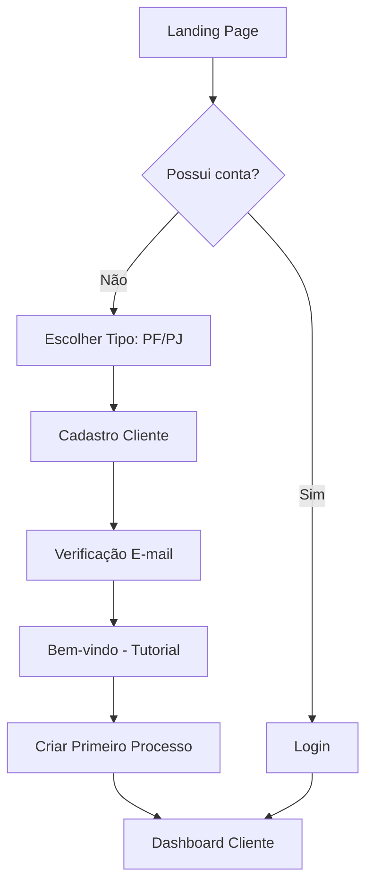
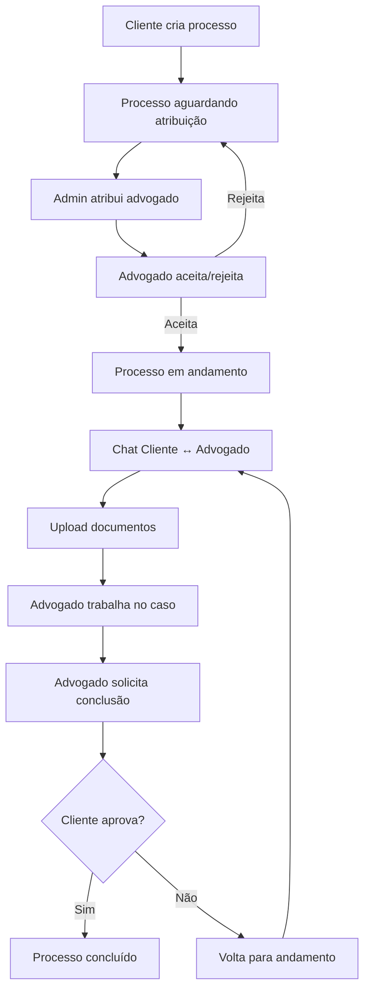
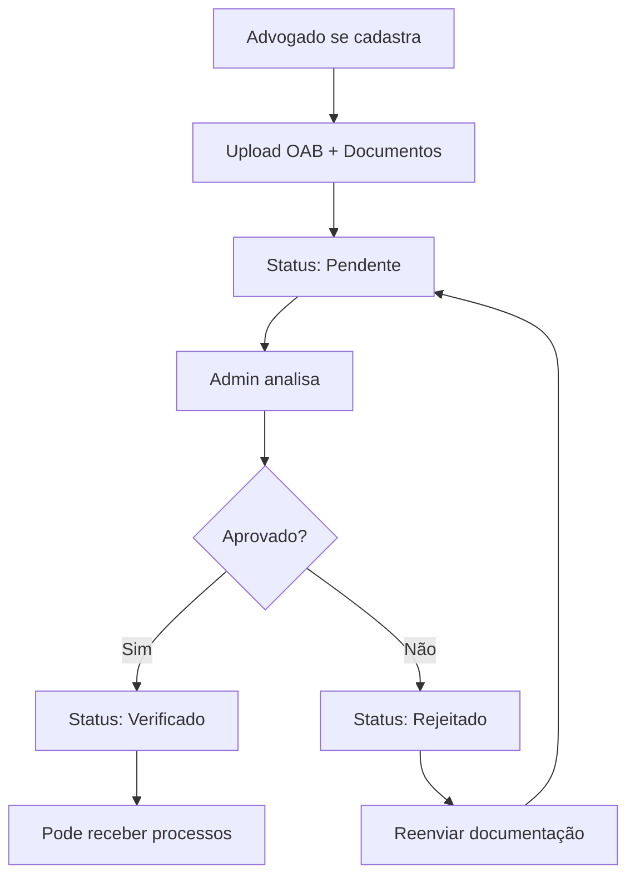

# Sitemap e Fluxos - Plataforma Jurídica

## Análise dos Documentos

### Perfis de Usuário Identificados
1. **Cliente** (Pessoa Física/Jurídica) - Usuário leigo que precisa de serviços jurídicos
2. **Advogado** - Profissional que presta serviços jurídicos
3. **Administrador** - Gerencia a plataforma e atribui processos

### Funcionalidades Principais Extraídas
- Autenticação e cadastro para os 3 perfis
- Gestão de processos jurídicos com workflow
- Sistema de chat entre cliente e advogado
- Painel administrativo para atribuição de processos
- Upload e gestão de documentos
- Sistema de aprovação/rejeição de conclusão

## Sitemap (Árvore de Rotas)

```
/
├── auth/
│   ├── login
│   ├── register
│   │   ├── cliente
│   │   ├── advogado
│   │   └── admin
│   ├── forgot-password
│   └── reset-password
├── onboarding/
│   ├── welcome
│   ├── profile-setup
│   └── verification
├── cliente/
│   ├── dashboard
│   ├── processos/
│   │   ├── lista
│   │   ├── novo
│   │   ├── detalhes/:id
│   │   └── documentos/:id
│   ├── chat/:processoId
│   └── perfil
├── advogado/
│   ├── dashboard
│   ├── processos/
│   │   ├── lista
│   │   ├── detalhes/:id
│   │   └── documentos/:id
│   ├── chat/:processoId
│   └── perfil
├── admin/
│   ├── dashboard
│   ├── processos/
│   │   ├── disponíveis
│   │   ├── atribuir/:id
│   │   └── todos
│   ├── usuarios/
│   │   ├── clientes
│   │   ├── advogados
│   │   └── verificacao
│   └── configuracoes
├── shared/
│   ├── ajuda
│   ├── faq
│   ├── termos-uso
│   ├── politica-privacidade
│   └── contato
└── error/
    ├── 404
    └── 500
```

## Fluxos Principais

### 1. Fluxo de Onboarding do Cliente (Usuário Leigo)



### 2. Fluxo de Processo (Cliente → Advogado → Conclusão)



### 3. Fluxo de Verificação de Advogado



## Páginas Prioritárias para o Protótipo

### 1. Páginas de Autenticação
- **Login** - Simples, com opção de recuperar senha
- **Registro** - Wizard em 3 passos (tipo usuário → dados → verificação)
- **Esqueci Senha** - Form simples com feedback

### 2. Onboarding/Welcome
- **Boas-vindas** - Hero section com benefícios claros
- **Tutorial Interativo** - Para clientes leigos (opcional)

### 3. Dashboard por Perfil
- **Cliente**: Cards com métricas, processos recentes, próximos passos
- **Advogado**: Processos ativos, pendências, chat alerts
- **Admin**: Métricas gerais, processos para atribuir, alerts

### 4. Gestão de Processos
- **Lista** - DataTable com filtros, busca, paginação
- **Detalhes** - Timeline de atividades, documentos, chat
- **Criar/Editar** - Forms com wizard para clientes leigos

### 5. Sistema de Chat
- **Interface** - Similar WhatsApp, com anexos e status

### 6. Estados Especiais
- **Empty States** - Para listas vazias com CTAs claros
- **Loading** - Skeletons em todas as listas/forms
- **Error** - Páginas 404/500 amigáveis

## Considerações para Usuários Leigos

### Linguagem e Microcópias
- Evitar jargões jurídicos
- Tooltips explicativos com ícone (i)
- Textos de ajuda contextuais
- CTAs claros ("Criar meu primeiro processo" vs "Novo")

### Navegação Simplificada
- Breadcrumb sempre visível
- Menu com ícones e labels claros
- Progresso visível em wizards
- Confirmações para ações importantes

### Feedback Visual
- Toast notifications para todas as ações
- Estados de loading em botões
- Validação inline nos forms
- Progress bars para uploads

## Dados Mock Necessários

### Entidades Principais
```json
{
  "usuarios": {
    "clientes": [...],
    "advogados": [...],
    "admins": [...]
  },
  "processos": {
    "status": ["aberto", "em_andamento", "aguardando_cliente", "concluido"],
    "tipos": ["trabalhista", "civil", "criminal", "familia", "tributario"],
    "lista": [...]
  },
  "mensagens": [...],
  "documentos": [...],
  "atividades": [...]
}
```

## Próximos Passos
1. Configurar projeto Angular com PrimeNG
2. Implementar layout base responsivo
3. Criar serviços mock com delay simulado
4. Implementar páginas por ordem de prioridade
5. Adicionar estados de UI e i18n
6. Testes de usabilidade com foco em leigos
