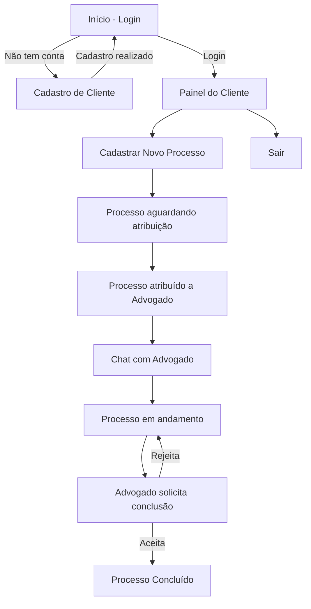
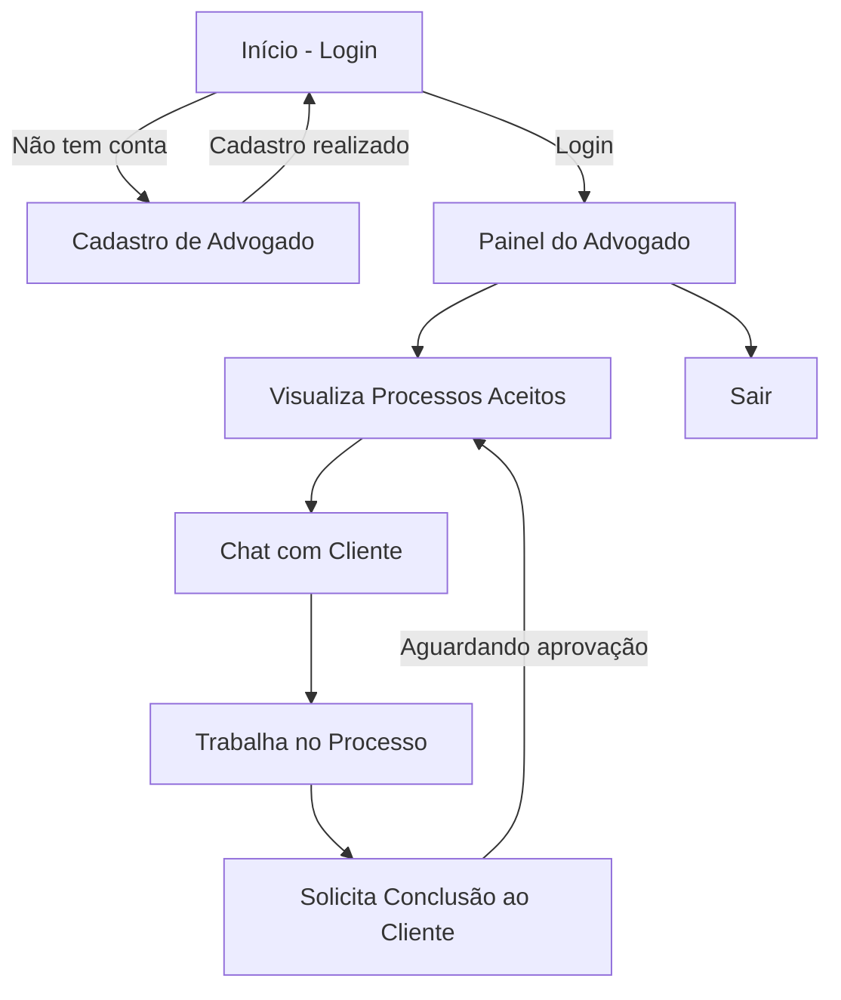
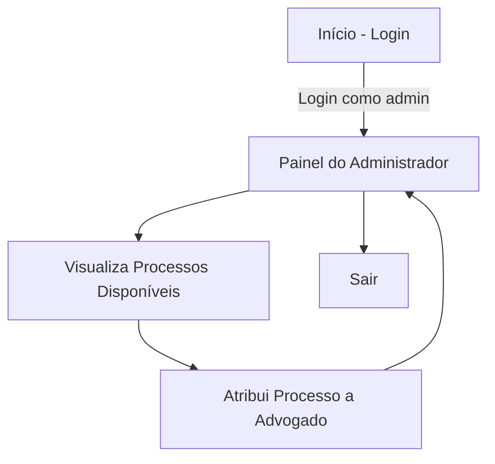

# Jornada do Usuário - Plataforma Jurídica

Este documento apresenta a jornada dos principais perfis de usuário do protótipo, utilizando diagramas Mermaid para ilustrar os fluxos de interação.

## Jornada do Cliente

## Jornada do Advogado

## Jornada do Administrador

